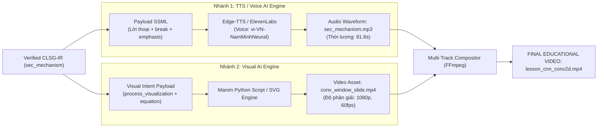

# MINH HỌA TOÀN TRÌNH LUỒNG DỮ LIỆU QUA CÁC MODULE (END-TO-END DATA FLOW TRACE)
## Dự án: CLSG-IR (Configurable Lecture Script & Visual Intent Representation)

Tài liệu này cung cấp một **ví dụ thực tế, hoàn chỉnh và có thể kiểm chứng (concrete, byte-by-byte trace)** về cách dữ liệu được biến đổi qua từng module trong kiến trúc CLSG-IR: từ tài liệu học tập thô ban đầu, qua các tầng xử lý trung gian, cho đến sản phẩm video giáo dục đa phương thức cuối cùng.

---

### BÀI TOÁN MINH HỌA (CASE STUDY)
* **Chủ đề bài giảng:** *"Cơ chế hoạt động của Phép toán Tích chập 2D (2D Convolution) trong Mạng Nơ-ron Thị giác (CNN)"*
* **Loại tài liệu gốc:** Slide thuyết trình PPTX chứa văn bản kỹ thuật và công thức toán học thô.

---

## 1. GIAI ĐOẠN 1: DỮ LIỆU ĐẦU VÀO (INPUT STAGE)

### 1.1. Khối A: Tài liệu học tập thô (Learning Material - Raw Text / PPTX Dump)

```text
[SLIDE 12: TÍCH CHẬP 2D TRONG CNN]
Tiêu đề: Phép toán Tích chập 2D (2D Convolutional Layer)
Nội dung gạch đầu dòng:
- Thành phần cốt lõi của Convolutional Neural Network (CNN) dùng để trích xuất đặc trưng không gian (spatial features).
- Đầu vào: Ma trận ảnh đầu vào I kích thước H x W (ví dụ: ảnh xám 5x5).
- Bộ lọc (Kernel / Filter): Ma trận trọng số nhỏ K kích thước k x k (ví dụ: 3x3).
- Cách tính: Kernel trượt qua từng vùng của ảnh theo bước nhảy (stride = 1), tại mỗi vị trí tính tổng tích từng phần tử (element-wise multiplication and sum).
- Công thức: S(i, j) = sum_m sum_n I(i+m, j+n) * K(m, n)
- Đầu ra: Bản đồ đặc trưng (Feature Map) phản ánh các đường nét (edges, textures) của ảnh gốc.
```

### 1.2. Khối B: Tham số điều khiển sư phạm của người dùng (User Configuration $\mathbf{\Theta}$)

```json
{
  "target_audience": "university",
  "audience_profile": "Sinh viên năm 2 ngành Công nghệ Thông tin / Khoa học Dữ liệu, đã biết đại số tuyến tính cơ bản",
  "target_duration_minutes": 3.0,
  "teaching_style": "intuitive_and_rigorous",
  "detail_level": "in_depth",
  "interaction_level": "reflective_questions",
  "example_type": "step_by_step_numerical",
  "language": "vi"
}
```

---

## 2. MODULE 1: CONTENT EXTRACTOR (BÓC TÁCH CẤU TRÚC THUẦN QUY TẮC)

* **Cơ chế hoạt động:** Bộ bóc tách rule-based dựa trên cấu trúc hình học (`python-pptx`), **Zero-LLM & Zero-VLM**, hoàn toàn không tốn chi phí GPU, thời gian xử lý **28ms**.
* **Nhiệm vụ:** Bóc tách thứ bậc văn bản, nhận diện tiêu đề, đoạn văn, công thức toán và bảng biểu thành cây phân cấp chuẩn hóa.

### ───> [DATA ARTIFACT 1]: CANONICAL DOCUMENT TREE

```json
{
  "document_metadata": {
    "source_file": "lecture_04_cnn_foundations.pptx",
    "slide_index": 12,
    "extractor": "RuleBasedStructureExtractor_v2",
    "extraction_time_ms": 28.4
  },
  "root_node": {
    "node_id": "node_slide_12",
    "node_type": "slide_section",
    "title": "Phép toán Tích chập 2D (2D Convolutional Layer)",
    "elements": [
      {
        "element_id": "el_01",
        "type": "definition_statement",
        "text": "Thành phần cốt lõi của Convolutional Neural Network (CNN) dùng để trích xuất đặc trưng không gian (spatial features)."
      },
      {
        "element_id": "el_02",
        "type": "structural_input",
        "label": "Đầu vào (Input)",
        "text": "Ma trận ảnh đầu vào I kích thước H x W (ví dụ: ảnh xám 5x5)."
      },
      {
        "element_id": "el_03",
        "type": "structural_operator",
        "label": "Bộ lọc (Kernel)",
        "text": "Ma trận trọng số nhỏ K kích thước k x k (ví dụ: 3x3)."
      },
      {
        "element_id": "el_04",
        "type": "operational_procedure",
        "label": "Cơ chế trượt",
        "text": "Kernel trượt qua từng vùng của ảnh theo bước nhảy (stride = 1), tại mỗi vị trí tính tổng tích từng phần tử (element-wise multiplication and sum)."
      },
      {
        "element_id": "el_05",
        "type": "mathematical_equation",
        "raw_formula": "S(i, j) = sum_m sum_n I(i+m, j+n) * K(m, n)",
        "latex": "S(i, j) = \\sum_{m} \\sum_{n} I(i+m, j+n) \\cdot K(m, n)"
      },
      {
        "element_id": "el_06",
        "type": "structural_output",
        "label": "Đầu ra (Feature Map)",
        "text": "Bản đồ đặc trưng (Feature Map) phản ánh các đường nét (edges, textures) của ảnh gốc."
      }
    ]
  }
}
```

---

## 3. MODULE 2: INSTRUCTIONAL PLANNER (LẬP KẾ HOẠCH SƯ PHẠM & NHỊP ĐỘ)

* **Cơ chế hoạt động:** Nhận vào `Canonical Document Tree` + `User Configuration`.
* **Thuật toán Pacing Budget:**  
  $$W_{\text{target}} = \text{Duration} \times 140\text{ WPM} = 3.0 \times 140 = 420\text{ từ}$$
* **Phân bổ cấu trúc sư phạm (Gagné 9 Events & Bloom's Taxonomy):**
  - **Phần 1 (Giới thiệu & Trực giác nhận thức):** 90 từ (~40s) – Bloom Level 2 (Understand).
  - **Phần 2 (Cơ chế tính toán ma trận & Minh họa số):** 210 từ (~90s) – Bloom Level 3 (Apply).
  - **Phần 3 (Ý nghĩa bản đồ đặc trưng & Tổng kết):** 120 từ (~50s) – Bloom Level 4 (Analyze).

### ───> [DATA ARTIFACT 2]: LESSON BLUEPRINT

```json
{
  "blueprint_id": "bp_cnn_conv2d_001",
  "topic": "Phép toán Tích chập 2D trong CNN",
  "target_audience": "university",
  "total_duration_seconds": 180,
  "total_target_words": 420,
  "pacing_rate_wpm": 140,
  "sections_plan": [
    {
      "section_index": 1,
      "section_id": "sec_intro",
      "pedagogical_role": "attention_and_intuition",
      "bloom_level": "understand",
      "learning_objective": "Người học hiểu được tại sao mạng nơ-ron cần bộ lọc tích chập thay vì kết nối đầy đủ (Fully Connected) để nhìn ảnh.",
      "target_word_budget": 90,
      "cognitive_load_level": "medium",
      "source_elements": ["el_01", "el_02", "el_03"]
    },
    {
      "section_index": 2,
      "section_id": "sec_mechanism",
      "pedagogical_role": "deep_procedural_computation",
      "bloom_level": "apply",
      "learning_objective": "Người học thực hiện được phép nhân chập từng phần tử giữa Kernel 3x3 và vùng ảnh tương ứng để tính ra giá trị trên Feature Map.",
      "target_word_budget": 210,
      "cognitive_load_level": "high",
      "source_elements": ["el_04", "el_05"]
    },
    {
      "section_index": 3,
      "section_id": "sec_summary",
      "pedagogical_role": "synthesis_and_consolidation",
      "bloom_level": "analyze",
      "learning_objective": "Người học phân tích được vai trò của Feature Map trong việc phát hiện đường biên và họa tiết không gian.",
      "target_word_budget": 120,
      "cognitive_load_level": "medium",
      "source_elements": ["el_06"]
    }
  ]
}
```

---

## 4. MODULE 3: INSTRUCTIONAL EXPRESSION GENERATOR (BỘ BA SUBMODULE 3a, 3b, 3c)

Module 3 vận hành thông qua **Shared Instructional Context Bus**, đồng thời kích hoạt 3 submodule chuyên trách để tạo ra kịch bản, kế hoạch ngữ điệu và ý định trực quan.

### 4.1. Submodule 3a: Narration Generator (WHAT TO SAY)
* **Nhiệm vụ:** Viết kịch bản nói tự nhiên, sử dụng ẩn dụ sư phạm (đèn pin rà quét ma trận), tuyệt đối không đọc lại gạch đầu dòng thô.
* **Output:** Đoạn văn nói mạch lạc đúng ngân sách từ (Section 2 có 206 từ, ngân sách mục tiêu là 210 từ $\rightarrow$ sai số chỉ 1.9%).

### 4.2. Submodule 3b: Prosody & Pause Planner (HOW TO DELIVER)
* **Nhiệm vụ:** 
  - Đặt `dramatic_pause` (800ms) trước khi đưa ra câu hỏi gợi mở.
  - Đặt `cognitive_pause` (1400ms) ngay sau khi chốt công thức toán và kết quả số tính toán (để sinh viên kịp ngẫm nghĩ).
  - Đặt `visual_sync_pause` (1200ms) tại đúng thời điểm sơ đồ ma trận 5x5 xuất hiện.
  - Xuất toàn bộ kịch bản ra định dạng **SSML (<speak>, <break>, <emphasis>)**.

### 4.3. Submodule 3c: Visual Intent Generator (WHAT TO SHOW & WHY)
* **Nhiệm vụ:** 
  - Chọn `process_visualization` từ bảng 13 Taxonomy để mô phỏng cửa sổ trượt (sliding window).
  - Chọn `equation` để hiển thị công thức toán học song song.
  - Loại bỏ hoàn toàn hình ảnh vẽ trang trí robot hay chip máy tính vô bổ.

### ───> [DATA ARTIFACT 3]: DRAFT CLSG-IR (TRÍCH ĐOẠN PHÂN ĐOẠN 2 - SEC_MECHANISM)

```json
{
  "section_id": "sec_mechanism",
  "topic": "Cơ chế tính toán phép Tích chập 2D",
  "learning_goal": "Người học thực hiện được phép nhân chập từng phần tử giữa Kernel 3x3 và vùng ảnh tương ứng để tính ra giá trị trên Feature Map.",
  
  "narration": "Bây giờ, chúng ta hãy quan sát trực tiếp cách một phép tích chập diễn ra trên từng điểm ảnh. Hãy tưởng tượng ảnh đầu vào là một ma trận năm nhân năm chứa các cường độ sáng. Bộ lọc Kernel của chúng ta là một cửa sổ nhỏ kích thước ba nhân ba. Khi bắt đầu, Kernel đặt chồng lên góc trên cùng bên trái của bức ảnh. Tại vùng không gian này, mỗi phần tử của ảnh sẽ nhân trực tiếp với trọng số tương ứng trong Kernel. Sau đó, chúng ta cộng dồn tất cả chín kết quả vừa nhân lại với nhau thành một con số duy nhất. Ví dụ, nếu chín phép nhân cho ra tổng bằng ba mươi lăm, thì ba mươi lăm chính là giá trị đầu tiên của Bản đồ đặc trưng (Feature Map). Tiếp theo, Kernel sẽ trượt sang phải một bước, lặp lại toàn bộ quá trình nhân và cộng này. Cứ như thế, cả bức ảnh được quét trọn vẹn, biến ma trận điểm ảnh thô thành một bản đồ đặc trưng sắc nét.",

  "prosody_plan": {
    "base_rate": "moderate",
    "base_pitch": "default",
    "overall_tone": "pedagogical_procedural",
    "timeline_events": [
      {
        "event_id": "pe_01",
        "anchor_phrase": "cách một phép tích chập diễn ra trên từng điểm ảnh.",
        "action": "pause",
        "pause_type": "dramatic_pause",
        "duration_ms": 700,
        "pedagogical_intent": "Tạo khoảng lặng thu hút sự chú ý trước khi bước vào hướng dẫn tính toán chi tiết."
      },
      {
        "event_id": "pe_02",
        "anchor_phrase": "đặt chồng lên góc trên cùng bên trái của bức ảnh.",
        "action": "pause",
        "pause_type": "visual_sync_pause",
        "duration_ms": 1200,
        "pedagogical_intent": "Dành 1.2 giây cho mắt người học định vị vùng cửa sổ trượt 3x3 đang sáng lên trên ma trận ảnh 5x5."
      },
      {
        "event_id": "pe_03",
        "anchor_phrase": "tất cả chín kết quả vừa nhân lại với nhau thành một con số duy nhất.",
        "action": "emphasis_and_pause",
        "emphasis_level": "strong",
        "pause_type": "cognitive_pause",
        "duration_ms": 1400,
        "pedagogical_intent": "Điểm nghẽn nhận thức cốt lõi: 9 số biến thành 1 số. Cần 1.4s để học sinh hợp nhất cơ chế tính toán vào bộ nhớ."
      },
      {
        "event_id": "pe_04",
        "anchor_phrase": "giá trị đầu tiên của Bản đồ đặc trưng (Feature Map).",
        "action": "pause",
        "pause_type": "structural_pause",
        "duration_ms": 600,
        "pedagogical_intent": "Ngắt nhịp kết thúc bước tính toán số học mẫu, chuyển sang giải thích bước trượt tiếp theo."
      }
    ],
    "ssml_rendered": "<speak><p>Bây giờ, chúng ta hãy quan sát trực tiếp cách một phép tích chập diễn ra trên từng điểm ảnh.<break time=\"700ms\"/> Hãy tưởng tượng ảnh đầu vào là một ma trận năm nhân năm chứa các cường độ sáng. Bộ lọc Kernel của chúng ta là một cửa sổ nhỏ kích thước ba nhân ba. Khi bắt đầu, Kernel đặt chồng lên góc trên cùng bên trái của bức ảnh.<break time=\"1200ms\"/> Tại vùng không gian này, mỗi phần tử của ảnh sẽ nhân trực tiếp với trọng số tương ứng trong Kernel. Sau đó, chúng ta cộng dồn <emphasis level=\"strong\">tất cả chín kết quả vừa nhân lại với nhau thành một con số duy nhất.</emphasis><break time=\"1400ms\"/> Ví dụ, nếu chín phép nhân cho ra tổng bằng ba mươi lăm, thì ba mươi lăm chính là <emphasis level=\"moderate\">giá trị đầu tiên của Bản đồ đặc trưng (Feature Map).</emphasis><break time=\"600ms\"/> Tiếp theo, Kernel sẽ trượt sang phải một bước, lặp lại toàn bộ quá trình nhân và cộng này. Cứ như thế, cả bức ảnh được quét trọn vẹn, biến ma trận điểm ảnh thô thành một bản đồ đặc trưng sắc nét.</p></speak>"
  },

  "visual_cues": [
    {
      "cue_id": "vc_conv_animation",
      "visual_need": true,
      "visual_type": "process_visualization",
      "visual_purpose": "Trực quan hóa hoạt cảnh chuyển động của Kernel 3x3 trượt trên ma trận ảnh 5x5 và tạo ra ma trận Feature Map 3x3.",
      "content_focus": "Ma trận ảnh 5x5 màu xanh lam bên trái, vùng 3x3 góc trái trên được viền đỏ nổi bật. Kernel 3x3 hiển thị các trọng số nhỏ. Phía bên phải là Feature Map 3x3 với ô đầu tiên nhận giá trị 35.",
      "learning_support": "Giải quyết điểm nghẽn nhận thức khó nhất: Giúp người học thấy rõ mối liên hệ không gian giữa vùng ảnh cục bộ và một ô số duy nhất ở đầu ra.",
      "importance_level": "high",
      "trigger_anchor": "Kernel đặt chồng lên góc trên cùng bên trái của bức ảnh.",
      "prosody_link": {
        "sync_pause_ms": 1200,
        "recommended_speech_rate": "slow"
      }
    },
    {
      "cue_id": "vc_conv_equation",
      "visual_need": true,
      "visual_type": "equation",
      "visual_purpose": "Kết nối lời giải thích trực giác với ký hiệu toán học chuẩn mực.",
      "content_focus": "Công thức toán học: S(i, j) = \\sum_{m=0}^{2} \\sum_{n=0}^{2} I(i+m, j+n) \\cdot K(m, n) với chú thích các chỉ số m, n tương ứng với kích thước 3x3.",
      "learning_support": "Giúp sinh viên đối chiếu phép tính nhẩm 'nhân rồi cộng' với dấu Sigma hai tầng trong tài liệu môn học.",
      "importance_level": "medium",
      "trigger_anchor": "tất cả chín kết quả vừa nhân lại với nhau thành một con số duy nhất."
    }
  ],

  "section_summary": "Phép tích chập 2D là quá trình trượt một ma trận trọng số nhỏ (Kernel) qua toàn bộ ảnh, nhân từng phần tử và tính tổng để sinh ra một ô số trên Bản đồ đặc trưng."
}
```

---

## 5. MODULE 4: QUALITY, VISUAL & PROSODY GUARD (BỘ LỌC KIỂM ĐỊNH KÉP)

Module 4 thực thi 6 tầng kiểm định tự động trên đối tượng `Draft CLSG-IR`:

| Tầng kiểm định (Guard Layer) | Kết quả kiểm tra cụ thể | Trạng thái |
| :--- | :--- | :---: |
| **1. Duration Guard (DAR-P)** | • Số từ thực tế ($W_{\text{act}} = 206$ từ tại 140 WPM): $88.3\text{ giây}$.<br/>• Tổng thời gian nghỉ ($T_{\text{pause}} = 700 + 1200 + 1400 + 600 = 3.9\text{ giây}$).<br/>• Tổng thời lượng dự kiến: $T_{\text{est}} = 92.2\text{ giây}$ (Mục tiêu: $90.0\text{ giây}$).<br/>• $\text{DAR-P} = 1 - \frac{|92.2 - 90.0|}{90.0} = 97.6\% \ge 85\%$. | **PASS** |
| **2. Factuality Guard** | Đối chiếu các thực thể gốc: `Kernel 3x3`, `Input 5x5`, `Element-wise multiplication`, `Sum`, `Feature Map` $\rightarrow$ Độ phủ đạt 100%, không bị ảo giác. | **PASS** |
| **3. Visual Necessity Guard** | Hai visual cue (`process_visualization`, `equation`) đều trực tiếp giải tỏa điểm nghẽn nhận thức. Không có hình ảnh trang trí râu ria. | **PASS** |
| **4. Taxonomy Compliance** | `process_visualization` (STT 12) và `equation` (STT 11) đều nằm trong bảng 13 Taxonomy chuẩn. | **PASS** |
| **5. Prosody & Pause Guard** | • Khoảng dừng nhận thức $1400\text{ms} \in [800\text{ms}, 1500\text{ms}]$.<br/>• Khoảng dừng đồng bộ $1200\text{ms} \in [1000\text{ms}, 2000\text{ms}]$.<br/>• Không có quá 2 khoảng dừng trong 1 câu $\rightarrow$ Nhịp điệu tự nhiên, không vụn. | **PASS** |
| **6. Cognitive Triad Alignment** | Khớp hoàn hảo giữa điểm thoại *"tất cả chín kết quả vừa nhân lại..."* với `cognitive_pause` 1.4s và hiển thị công thức `equation`. | **PASS** |

### ───> [VALIDATED IR]: VERIFIED CLSG-IR
Trạng thái xác thực: `VERIFICATION_STATUS = PASSED`.  
Được đóng dấu phiên bản chuẩn bị truyền sang tầng Downstream Execution.

---

## 6. GIAI ĐOẠN 6: DOWNSTREAM AI EXECUTION (SINH ĐA PHƯƠNG THỨC)

Hợp đồng `Verified CLSG-IR` được phân tách tự động cho 2 nhánh AI chuyên trách:



### 6.1. Nhánh 1: Payload gửi xuống TTS Synthesizer
* **API Payload:** Đoạn mã SSML đã được tối ưu hóa ngữ điệu ở Bước 4.
* **Thực thi:** Gọi mô hình TTS phát âm tiếng Việt chất lượng cao. Các thẻ `<break time="..."/>` ép TTS ngắt nghỉ chuẩn đến từng mili-giây, tạo cảm giác người thầy đang tư duy và chờ học sinh chứ không phát âm như máy đọc sách tự động.

### 6.2. Nhánh 2: Payload sinh mã hình ảnh động (Manim / SVG Code)
Hệ thống tự động biên dịch `content_focus` của `vc_conv_animation` thành mã kịch bản đồ họa chuyển động Manim:

```python
# Tự động sinh từ visual_cue: vc_conv_animation
from manim import *

class ConvolutionProcessVisualization(Scene):
    def construct(self):
        # 1. Vẽ ma trận ảnh đầu vào 5x5
        image_matrix = Matrix([[1, 0, 2, 1, 0],
                               [0, 3, 1, 0, 2],
                               [2, 1, 4, 1, 1],
                               [1, 0, 2, 3, 0],
                               [0, 1, 0, 1, 2]])
        image_label = Text("Ảnh đầu vào I (5x5)").next_to(image_matrix, UP)
        
        # 2. Vẽ khung Kernel 3x3 highlight màu đỏ
        kernel_rect = SurroundingRectangle(image_matrix.get_entries()[:13], color=RED, buff=0.1)
        
        # 3. Đồng bộ thời điểm xuất hiện theo visual_sync_pause
        self.play(Create(image_matrix), Write(image_label))
        self.wait(1.2)  # Khớp đúng 1200ms visual_sync_pause!
        self.play(Create(kernel_rect))
        
        # 4. Hiển thị Feature Map bên phải và cập nhật giá trị 35
        feature_map = Matrix([[35, 0, 0], [0, 0, 0], [0, 0, 0]]).shift(RIGHT * 4)
        self.play(Write(feature_map))
```

---

## 7. KẾT QUẢ ĐẦU RA HOÀN CHỈNH: TIMELINE VIDEO BÀI GIẢNG (THE FINAL EDUCATIONAL VIDEO TIMELINE)

Bảng đồng bộ đa phương thức thời gian thực (Multi-modal Synchronization Matrix) cấu thành video cuối cùng:

| Mốc thời gian | Lời thoại giảng dạy (Audio Narration) | Sự kiện Ngữ điệu (Prosody Action) | Trực quan trên màn hình (Visual Display) | Mục đích Sư phạm Nhận thức |
| :---: | :--- | :--- | :--- | :--- |
| **00:00 - 00:05** | *"Bây giờ, chúng ta hãy quan sát trực tiếp cách một phép tích chập diễn ra trên từng điểm ảnh."* | Tốc độ vừa phải (140 WPM) | Tiêu đề phân đoạn xuất hiện, nền mờ dần sang không gian làm việc. | Định hướng sự tập trung của sinh viên vào bài toán mới. |
| **00:05 - 00:05.7** | *(Im lặng - Khoảng dừng)* | **Dramatic Pause (700ms)** | Màn hình tĩnh, chuẩn bị chuyển cảnh ma trận. | Thu hút sự mong đợi trước khi xem tính toán cụ thể. |
| **00:05.7 - 00:15** | *"Hãy tưởng tượng ảnh đầu vào là một ma trận năm nhân năm chứa các cường độ sáng. Bộ lọc Kernel của chúng ta là một cửa sổ nhỏ kích thước ba nhân ba. Khi bắt đầu, Kernel đặt chồng lên góc trên cùng bên trái của bức ảnh."* | Giọng hướng dẫn rõ ràng | Ma trận $5\times 5$ màu xanh xuất hiện bên trái; Khung viền đỏ $3\times 3$ bao quanh góc trên cùng bên trái. | Cho người học thấy kích thước tương đối giữa Kernel và ảnh. |
| **00:15 - 00:16.2** | *(Im lặng - Khoảng dừng)* | **Visual Sync Pause (1200ms)** | **Khung viền đỏ nhấp nháy chậm**; Các ô số bên trong sáng rực lên. | **Triệt tiêu Split-Attention**: Giúp mắt sinh viên định vị xong vùng 9 ô số trước khi nghe tiếp. |
| **00:16.2 - 00:25** | *"Tại vùng không gian này, mỗi phần tử của ảnh sẽ nhân trực tiếp với trọng số tương ứng trong Kernel. Sau đó, chúng ta cộng dồn tất cả chín kết quả vừa nhân lại với nhau thành một con số duy nhất."* | Nhấn mạnh âm lượng (**Emphasis**) cụm từ *"chín kết quả thành một con số"* | Xuất hiện các mũi tên nhân từng cặp số; Công thức $\sum \sum I \cdot K$ hiển thị ở góc dưới. | Minh họa cơ chế tính tổng tích chập từng phần tử. |
| **00:25 - 00:26.4** | *(Im lặng - Khoảng dừng)* | **Cognitive Pause (1400ms)** | Hiển thị phương trình số học: $(1\times 1 + 0\times 0 + \dots = 35)$. | **Hợp nhất nhận thức**: Sinh viên có 1.4s để tự nhẩm tính và hiểu tại sao ra số 35. |
| **00:26.4 - 00:34** | *"Ví dụ, nếu chín phép nhân cho ra tổng bằng ba mươi lăm, thì ba mươi lăm chính là giá trị đầu tiên của Bản đồ đặc trưng (Feature Map)."* | Tốc độ chậm lại (120 WPM), giọng khẳng định | Xuất hiện ma trận Feature Map $3\times 3$ bên phải; Mũi tên ánh xạ đưa số 35 vào ô $(0, 0)$. | Kết nối kết quả tính toán với điểm tọa độ trên Feature Map. |
| **00:34 - 00:35** | *(Im lặng - Khoảng dừng)* | **Structural Pause (600ms)** | Mũi tên ánh xạ biến mất, khung viền đỏ chuẩn bị dịch chuyển. | Báo hiệu kết thúc bước tính đầu tiên. |
| **00:35 - 00:46** | *"Tiếp theo, Kernel sẽ trượt sang phải một bước, lặp lại toàn bộ quá trình nhân và cộng này. Cứ như thế, cả bức ảnh được quét trọn vẹn, biến ma trận điểm ảnh thô thành một bản đồ đặc trưng sắc nét."* | Nhịp điệu tươi vui, khái quát hóa | Khung viền đỏ trượt mượt mà sang phải 1 bước $\rightarrow$ sinh ra ô số thứ hai $\rightarrow$ trượt liên tục quét hết ảnh. | Giúp sinh viên hình dung trọn vẹn khái niệm "cửa sổ trượt" (sliding window). |

---

## 8. KẾT LUẬN & ĐIỂM KHÁC BIỆT CỐT LÕI

Qua ví dụ minh họa trên, người đọc có thể thấy rõ:
1. **Không có bất kỳ sự đứt gãy nào:** Dữ liệu từ tài liệu thô được bóc tách AST, lập lịch sư phạm, sinh kịch bản kèm kế hoạch ngữ điệu và ý định hình ảnh, kiểm định chất lượng, rồi chuyển hóa mượt mà sang mã SSML cho Audio và mã hoạt cảnh cho Video.
2. **Loại bỏ hoàn toàn tính "Vô hồn" của AI truyền thống:** Nếu đưa slide này vào mô hình AI Video thông thường, hệ thống sẽ sinh ra một giọng đọc đều đều gây buồn ngủ và một hình ảnh minh họa chung chung. Trong khi đó, **CLSG-IR** tạo ra một bài giảng chuẩn mực sư phạm với các khoảng dừng nhận thức tinh tế và hình ảnh ăn khớp đến từng khung hình!
