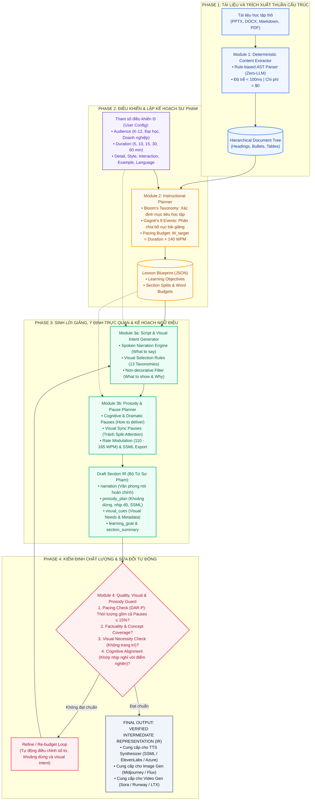

# BÁO CÁO PHƯƠNG PHÁP NGHIÊN CỨU & THIẾT KẾ HỆ THỐNG
# CONFIGURABLE LECTURE SCRIPT & VISUAL INTENT GENERATION (CLSG-IR)
## Khung Sinh Kịch Bản Giảng Dạy Đa Thuộc Tính, Kế Hoạch Ngữ Điệu & Siêu Dữ Liệu Trực Quan Sư Phạm Làm Cầu Nối Cho AI Video Generation

---

## 1. TỔNG QUAN VÀ ĐỘNG LỰC NGHIÊN CỨU (INTRODUCTION & MOTIVATION)

### 1.1. Bối cảnh bài toán & Khoảng trống thế hệ mới (The Next-Gen Research Gap)
Trong kỷ nguyên AI tạo sinh đa phương thức, bài toán chuyển đổi tài liệu học tập (slides PPTX, giáo trình DOCX, tài liệu Markdown/PDF) thành video bài giảng đang bùng nổ. Tuy nhiên, các hệ thống hiện hành gặp phải sự đứt gãy lớn giữa hai thế giới:
1. **Thế giới Soạn thảo Sư phạm (Pedagogical Scripting):** Các mô hình như **EduCraft (CIKM 2025)** cố gắng dùng mô hình thị giác (VLM) đọc từng slide để sinh kịch bản nói. Cách tiếp cận này bị trói cứng vào bố cục slide (*1 slide = 1 script fragment*), chi phí phần cứng rất lớn, thường xuyên bị ảo giác thị giác (visual hallucinations), và không thể tùy biến theo đối tượng người học hay thời lượng mong muốn.
2. **Thế giới Sinh Video & Giọng nói AI (AI Video & TTS Generation):** Các mô hình khuếch tán và video hiện đại (Sora, Runway Gen-3, LTX-Video, Midjourney, HeyGen) rất mạnh về mặt hình ảnh, và các TTS hiện đại rất mượt mà về ngữ âm, nhưng chúng **hoàn toàn mù về mặt sư phạm (Pedagogically Blind)**. Chúng không biết khi nào người học cần nhìn thấy một biểu đồ, khi nào cần một khoảng dừng nhận thức (Cognitive Pause) 1.5s để người học ngẫm nghĩ, và khi nào cần hạ tốc độ nói (Slow rate) để giải thích một công thức toán học.

### 1.2. Đột phá đề xuất: Intermediate Representation (IR) kết hợp Visual & Prosody Intent
Hệ thống đề xuất **CLSG-IR (Configurable Lecture Script & Visual Intent Generation)** định vị mình là **Lớp biểu diễn trung gian (Intermediate Representation - IR)** lý tưởng:

$$\text{Document} + \mathbf{\Theta}_{\text{user}} \xrightarrow[\text{Architect}]{\text{Instructional}} \underbrace{\text{Narration (What)} + \text{Prosody Plan (How)} + \text{Visual Intent (What to Show)}}_{\text{Intermediate Representation (IR)}} \xrightarrow[\text{Downstream}]{\text{AI Video / TTS}} \text{Educational Video}$$

### 1.3. Bộ Tứ Nguyên tắc Cốt lõi (The 4-Pillar Pedagogical Principles)
1. **Nội dung giảng dạy là ưu tiên tối thượng (What to say):** Lời giảng (`narration`) phải tự nhiên như văn phong nói trực tiếp của giảng viên, chuẩn xác về mặt khoa học.
2. **Kế hoạch ngữ điệu và khoảng dừng sư phạm (How to deliver):** Không phó mặc cho TTS ngâm thơ một cách vô hồn. Tích hợp chủ động các khoảng dừng nhận thức (`cognitive_pause`), khoảng dừng đồng bộ thị giác (`visual_sync_pause`) và biến điệu tốc độ (`rate_modulation`) để tối ưu hóa lý thuyết tải nhận thức (Cognitive Load Theory).
3. **Hình ảnh phục vụ mục tiêu học tập (What to show - Anti-decorative):** Tuyệt đối **không** đề xuất visual chỉ để trang trí giao diện. Chỉ xuất hiện visual khi nó giúp người học vượt qua điểm nghẽn nhận thức (Cognitive Bottlenecks).
4. **Phân định ranh giới trách nhiệm (Strict Scope Boundary):**
   - **Hệ thống này sinh:** Kịch bản nói (`narration`), Kế hoạch nhịp điệu/ngắt nghỉ (`prosody_plan`), Ý định trực quan sư phạm (`visual_cues` gồm *Visual Need, Visual Type, Visual Purpose, Content Focus, Learning Support, Importance Level*).
   - **Hệ thống này KHÔNG sinh:** Sóng âm thô (Acoustic audio), góc quay camera (Camera direction), hiệu ứng chuyển cảnh (Scene transition), hay danh sách storyboard shot-list (đây là nhiệm vụ của Video/TTS Generation Engine ở pha sau).

---

## 2. HỆ THỐNG PHÂN LOẠI TRỰC QUAN SƯ PHẠM (VISUAL INTENT TAXONOMY & RULES)

### 2.1. Visual Type Taxonomy (13 Phân loại Trực quan Chuẩn)
Mọi đề xuất minh họa bắt buộc phải thuộc một trong 13 phân loại chuẩn hóa sau:

| STT | Visual Type | Mục đích Sư phạm Chính | Ngữ cảnh Sử dụng Điển hình |
| :---: | :--- | :--- | :--- |
| 1 | `diagram` | Trực quan hóa cấu tạo, thành phần hoặc mô hình tĩnh. | Định nghĩa khái niệm, kiến trúc phần cứng, giải phẫu học. |
| 2 | `flowchart` | Thể hiện chuỗi bước tuần tự hoặc luồng logic rẽ nhánh. | Thuật toán, quy trình nghiệp vụ, chu trình ra quyết định. |
| 3 | `comparison` | Đối chiếu song song ưu/nhược điểm hoặc đặc tính khác biệt. | So sánh 2 phương pháp (vd: Supervised vs Unsupervised). |
| 4 | `infographic` | Tổng hợp tri thức đa chiều, kết hợp số liệu và biểu tượng. | Toàn cảnh hệ sinh thái, tóm tắt các nguyên lý lớn. |
| 5 | `chart` | Trực quan hóa dữ liệu định lượng, xu hướng biến thiên. | Biểu đồ đường (Line), cột (Bar), phân tán (Scatter), độ chính xác. |
| 6 | `table` | Cấu trúc hóa thông tin đa thuộc tính dạng ma trận. | Bảng đối chiếu tham số kỹ thuật, bảng dữ liệu mẫu. |
| 7 | `screenshot` | Minh chứng giao diện thực tế của phần mềm hoặc hệ thống. | Hướng dẫn thao tác công cụ phần mềm, dòng lệnh terminal. |
| 8 | `illustration` | Tranh vẽ ẩn dụ hoặc hình ảnh trực quan hóa ý niệm trừu tượng. | Minh họa cơ chế mạng neuron như não người, ẩn dụ đời sống. |
| 9 | `real_world_example` | Tình huống thực tế, vật thể hoặc bối cảnh đời thực cụ thể. | Ảnh chụp ứng dụng thực tế ngoài hiện trường, sản phẩm thật. |
| 10 | `timeline` | Diễn biến phát triển theo trục thời gian tuyến tính. | Lịch sử tiến hóa công nghệ, các mốc cột mốc lịch sử. |
| 11 | `equation` | Hiển thị công thức toán học, ký hiệu logic chặt chẽ. | Định lý, đạo hàm, hàm mất mát (Loss function), phương trình. |
| 12 | `process_visualization` | Mô phỏng dòng chảy hoạt động động lực của hệ thống kỹ thuật.| Đường đi của dữ liệu qua các tầng mạng, chu trình pít-tông động cơ. |
| 13 | `concept_map` | Mạng lưới các khái niệm và mối quan hệ ngữ nghĩa qua lại. | Bản đồ tư duy kiến thức liên ngành, cây phân loại thực thể. |

### 2.2. Visual Selection Rules (Quy tắc Chọn Visual Bắt buộc)
```text
- Định nghĩa khái niệm trừu tượng      ──> diagram HOẶC concept_map
- Quy trình nhiều bước / giải thuật   ──> flowchart
- So sánh hai hay nhiều khái niệm      ──> comparison
- Dữ liệu số liệu định lượng           ──> chart
- Diễn tiến lịch sử / các giai đoạn    ──> timeline
- Tình huống thực tế / Ẩn dụ đời sống ──> real_world_example HOẶC illustration
- Công thức toán / Vật lý / Hóa học    ──> equation
- Cơ chế vận hành hệ thống kỹ thuật    ──> process_visualization
```

---

## 3. KIẾN TRÚC HỆ THỐNG ĐỀ XUẤT (SYSTEM ARCHITECTURE & PIPELINE)


### 3.1. Sơ đồ dòng chảy dữ liệu hoàn chỉnh (Data Flow Pipeline)



### 3.2. Chức năng chi tiết của các Module

1. **Module 1: Deterministic Content Extractor (Zero-Vision & Zero-LLM)**
   - Bóc tách trực tiếp PPTX (`shapes.title`, `text_frame.paragraphs`, `table`), DOCX (`Heading 1-3`, `paragraphs`) và Markdown thành `DocumentTree`.
   - Đạt tốc độ tuyệt đối (< 100ms), loại bỏ hoàn toàn chi phí GPU VLM của EduCraft.
2. **Module 2: Instructional Planner (Lập kế hoạch nhịp độ & mục tiêu)**
   - Tính toán ngân sách từ $W_{\text{target}} = \text{Duration} \times 140 \text{ từ/phút}$.
   - Xác định `learning_goal` cụ thể cho từng phần theo Bloom's Taxonomy.
3. **Module 3a: Script & Visual Intent Generator (What to say & What to show)**
   - Sinh lời thoại giảng dạy (`narration`) giàu biểu cảm nói, liên kết ngữ cảnh qua Rolling Context Memory.
   - Quét qua nội dung lời giảng để xác định: *"Điểm nào người học khó hình dung nhất?"* $\rightarrow$ Kích hoạt `visual_need = true` và chọn đúng `visual_type` từ 13 Taxonomy.
4. **Module 3b: Prosody & Pause Planner (How to deliver - Hạt nhân mới)**
   - Không để TTS phát âm vô hồn. Lập kế hoạch ngữ điệu dựa trên Thuyết tải nhận thức (Cognitive Load Theory).
   - Tự động gài cắm các loại khoảng dừng:
     - `cognitive_pause` (800ms - 1500ms): Cho phép não bộ hợp nhất thông tin sau khái niệm khó.
     - `visual_sync_pause` (1000ms - 2000ms): Đồng bộ mắt người học với visual cue mới xuất hiện (tránh Split-Attention Effect).
     - `dramatic_pause` (500ms - 1000ms): Tạo độ chú ý trước định lý hoặc nghịch lý.
     - `structural_pause` (300ms - 600ms): Ngắt nhịp logic.
   - Điều biến tốc độ nói (`slow`, `moderate`, `brisk`) và xuất chuẩn **SSML (<speak>, <break>, <emphasis>)**.
5. **Module 4: Quality, Visual & Prosody Guard (Bộ lọc kiểm định kép)**
   - **DAR-P Pacing Check:** Đo thời lượng thực tế bao gồm cả thời gian phát âm theo WPM và tổng thời gian các khoảng dừng:
     $$T_{\text{estimated}} = \left( \sum \frac{W_k}{\text{WPM}_k} \right) + \sum \frac{\text{Duration}_{\text{ms}}}{1000}$$
     Đảm bảo sai số so với $T_{\text{target}}$ không lệch quá 15%.
   - **Visual Necessity Guard:** Loại bỏ bất kỳ visual cue nào mang tính trang trí hoặc không trực tiếp bổ trợ cho `learning_goal`.
   - **Cognitive Pause Alignment:** Đảm bảo mọi điểm nghẽn nhận thức và hình ảnh phức tạp đều có khoảng dừng tương ứng.

---

## 4. ĐẶC TẢ SCHEMA DỮ LIỆU CHUẨN (INTERMEDIATE REPRESENTATION SCHEMA)

Toàn bộ hệ thống giao tiếp qua hợp đồng dữ liệu JSON chuẩn mực:

```json
{
  "section_id": "sec_01",
  "topic": "Cơ chế Học có giám sát (Supervised Learning)",
  "learning_goal": "Người học hiểu được cách thức mô hình học máy tìm ra hàm ánh xạ từ dữ liệu đầu vào (X) đến nhãn đầu ra (Y) thông qua hàm mất mát.",
  "narration": "Chào các bạn. Để hiểu Học có giám sát, hãy bắt đầu từ cách con người học làm toán. Khi làm bài tập, chúng ta có đề bài và có cả phần đáp án phía sau sách. Chúng ta giải, so khớp với đáp án, thấy sai thì sửa lại cách làm. Thuật toán học có giám sát cũng hoạt động y hệt như vậy. Nó nhận vào tập dữ liệu X — ví dụ như diện tích, số phòng của một ngôi nhà — đi kèm với nhãn Y là giá tiền thực tế của ngôi nhà đó. Ban đầu, mô hình đoán mò một mức giá. Sự chênh lệch giữa giá mô hình đoán và giá thực tế được tính toán bằng một công cụ gọi là Hàm mất mát (Loss Function). Càng sai nhiều, mô hình càng phải điều chỉnh lại các trọng số bên trong cho đến khi khoảng cách sai số này nhỏ nhất có thể.",
  "prosody_plan": {
    "base_rate": "moderate",
    "base_pitch": "default",
    "overall_tone": "pedagogical_exploratory",
    "timeline_events": [
      {
        "anchor_phrase": "hoạt động y hệt như vậy.",
        "action": "pause",
        "pause_type": "dramatic_pause",
        "duration_ms": 800,
        "pedagogical_intent": "Tạo khoảng lặng chờ đợi trước khi đi vào giải thích cơ chế kỹ thuật cụ thể."
      },
      {
        "anchor_phrase": "Hàm mất mát (Loss Function).",
        "action": "emphasis_and_pause",
        "emphasis_level": "strong",
        "pause_type": "cognitive_pause",
        "duration_ms": 1200,
        "pedagogical_intent": "Khái niệm trung tâm của bài học. Cần 1.2s để học sinh kịp ghi nhớ thuật ngữ Loss Function."
      },
      {
        "anchor_phrase": "nhỏ nhất có thể.",
        "action": "pause",
        "pause_type": "structural_pause",
        "duration_ms": 600,
        "pedagogical_intent": "Kết thúc khối kiến thức lý thuyết, chuẩn bị chuyển sang ví dụ."
      }
    ],
    "ssml_rendered": "<speak><p>Chào các bạn. Để hiểu Học có giám sát, hãy bắt đầu từ cách con người học làm toán. Khi làm bài tập, chúng ta có đề bài và có cả phần đáp án phía sau sách. Chúng ta giải, so khớp với đáp án, thấy sai thì sửa lại cách làm. Thuật toán học có giám sát cũng <emphasis level=\"moderate\">hoạt động y hệt như vậy.</emphasis><break time=\"800ms\"/> Nó nhận vào tập dữ liệu X — ví dụ như diện tích, số phòng của một ngôi nhà — đi kèm với nhãn Y là giá tiền thực tế của ngôi nhà đó. Ban đầu, mô hình đoán mò một mức giá. Sự chênh lệch giữa giá mô hình đoán và giá thực tế được tính toán bằng một công cụ gọi là <emphasis level=\"strong\">Hàm mất mát (Loss Function)</emphasis>.<break time=\"1200ms\"/> Càng sai nhiều, mô hình càng phải điều chỉnh lại các trọng số bên trong cho đến khi khoảng cách sai số này nhỏ nhất có thể.<break time=\"600ms\"/></p></speak>"
  },
  "visual_cues": [
    {
      "cue_id": "vc_01",
      "visual_need": true,
      "visual_type": "process_visualization",
      "visual_purpose": "Mô tả vòng lặp học tập khép kín giữa Dự đoán, Sai số và Cập nhật trọng số.",
      "content_focus": "Sơ đồ khối thể hiện luồng dữ liệu: Đầu vào (X) đi qua Mô hình dự đoán -> Cho ra Y_dự_đoán -> So sánh với Y_thực_tế qua Loss Function -> Tín hiệu phản hồi ngược về để điều chỉnh trọng số Mô hình.",
      "learning_support": "Giúp người học thấy rõ 'sự giám sát' thực chất diễn ra ở khâu nào trong thuật toán, giải tỏa điểm khó hiểu nhất là cách mô hình tự sửa sai.",
      "importance_level": "high",
      "trigger_anchor": "Hàm mất mát (Loss Function).",
      "prosody_link": {
        "sync_pause_ms": 1200,
        "recommended_speech_rate": "slow"
      }
    },
    {
      "cue_id": "vc_02",
      "visual_need": true,
      "visual_type": "equation",
      "visual_purpose": "Chuẩn hóa khái niệm toán học cốt lõi của bài toán hồi quy tuyến tính cơ bản.",
      "content_focus": "Phương trình hàm ánh xạ tổng quát: y = f(x; W, b) và hàm mất mát Mean Squared Error (MSE).",
      "learning_support": "Giúp người học kết nối lời giải thích mang tính trực giác ở trên với công thức toán học chuẩn tắc trong tài liệu chuyên ngành.",
      "importance_level": "medium",
      "trigger_anchor": "khoảng cách sai số này nhỏ nhất có thể."
    }
  ],
  "section_summary": "Học có giám sát là quá trình tối thiểu hóa sai số giữa kết quả dự đoán và nhãn thực tế thông qua việc liên tục cập nhật trọng số mô hình."
}
```

---

## 5. SO SÁNH ĐỐI TRỌNG VỚI EDU CRAFT (CIKM 2025)

| Tiêu chí So sánh | EduCraft (CIKM 2025) | Khung Đề xuất CLSG-IR (EduTailor) |
| :--- | :--- | :--- |
| **Bản chất đầu ra** | Kịch bản trình bày thô theo slide | **Intermediate Representation (IR)** cho Video AI |
| **Xử lý hình ảnh** | Phụ thuộc VLM/OCR nhận diện slide ảnh | **Zero-Vision Extractor** (Cực nhẹ, không tốn GPU) |
| **Siêu dữ liệu trực quan** | Không có (Hoặc chỉ là mô tả slide tĩnh) | **Visual Intent Metadata** (13 Taxonomies + Rules) |
| **Mục đích của Visual** | Bị chi phối bởi nội dung có sẵn trên slide | **100% phục vụ nhận thức** (Chống visual trang trí) |
| **Tính linh hoạt thời lượng**| Cố định số slide = số script | **Co giãn tuyệt đối** theo thời lượng mục tiêu (WPM) |
| **Khả năng nối ghép** | Chỉ đọc nội dung slide | **Cầu nối trực tiếp** tới Sora, Runway, Midjourney |

---

## 6. HỆ THỐNG CHỈ SỐ ĐÁNH GIÁ (EVALUATION METRICS)

Ngoài các chỉ số về chất lượng văn bản và nhịp điệu bài giảng, hệ thống bổ sung nhóm chỉ số đánh giá **Visual Intent Quality**:

1. **Visual Necessity Score (VNS):** Đánh giá bởi chuyên gia giáo dục hoặc LLM-Critic xem các visual cue đề xuất có thực sự giải quyết khó khăn nhận thức hay chỉ là trang trí thừa thãi.
2. **Taxonomy Compliance Rate (TCR):** Tỉ lệ 100% các visual cues tuân thủ nghiêm ngặt bảng 13 loại trong taxonomy quy định.
3. **Alignment Ratio ($R_{\text{align}}$):** Mức độ tương thích giữa `content_focus` trong visual cue với `narration` tại thời điểm lời giảng tương ứng.
4. **Duration Adherence Rate (DAR):**
   $$\text{DAR} = 1 - \frac{|W_{\text{actual}} - W_{\text{target}}|}{W_{\text{target}}}$$

---

## 7. KẾT LUẬN & ĐỊNH HƯỚNG BÀI BÁO KHOA HỌC

Đề xuất **CLSG-IR** giải quyết triệt để ranh giới ngăn cách giữa tài liệu văn bản sư phạm và các mô hình tạo video AI hiện đại. Bằng việc định vị sản phẩm đầu ra là **Intermediate Representation (IR)** kết hợp giữa **Spoken Narration** và **Visual Intent Metadata**, nghiên cứu mở ra hướng đi đột phá, vừa sẵn sàng cho công bố tại các hội nghị uy tín (**AIED, EDM, CIKM, EMNLP, ACM Multimedia**), vừa có thể lập tức ứng dụng sản xuất hàng loạt video bài giảng chất lượng cao với chi phí tối ưu.
