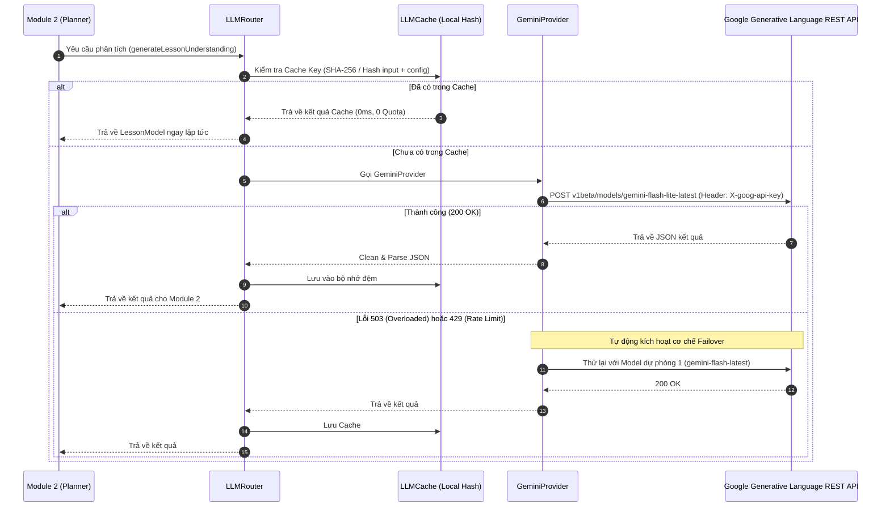

# Luồng Dữ Liệu Toàn Hệ Thống CLSG-IR (System Data Flow Architecture)

> **Tài liệu đặc tả kỹ thuật chi tiết:** Toàn bộ luồng dữ liệu (End-to-End Data Flow), các chặng biến đổi (Transformation Stages), cấu trúc dữ liệu trung gian (Data Contracts), hạ tầng gọi LLM và cơ chế chịu lỗi (Fault Tolerance) của hệ thống **CLSG-IR Studio**.

---

## 1. Sơ Đồ Tổng Thể Luồng Dữ Liệu (End-to-End Flow Diagram)

Hệ thống CLSG-IR xử lý tài liệu học tập đầu vào (Slide PPTX, PDF, DOCX) và chuyển đổi thành **Biểu diễn trung gian kịch bản bài giảng & ý đồ thị giác (Configurable Lecture Script & Visual Intent Representation - CLSG-IR)** qua 4 module tuần tự:

```mermaid
flowchart TD
    subgraph UI_Client ["1. Tầng Giao Diện & Tải Lên (Client UI)"]
        A["Người Dùng Tải Tệp (PPTX / PDF / DOCX)"] --> B["Cấu Hình Sư Phạm (UserConfiguration)\n- Ngôn ngữ, Pacing, Learner Level, Style, Duration"]
        A --> Cloudinary["Cloudinary CDN\n(Lưu trữ file gốc & sinh secure URL)"]
        A & B --> Orchestrator["Pipeline Orchestrator\n(Điều phối toàn bộ Pipeline)"]
    end

    subgraph M1 ["2. Module 1: Content Extractor (0-LLM, Rule-based)"]
        Orchestrator --> Extractor{"Loại tệp?"}
        Extractor -->|PPTX| PPTXExt["PPTXExtractor\n(jszip + XML parsing: shapes, text, tables, notes)"]
        Extractor -->|PDF| PDFExt["PDFExtractor\n(pdfjs-dist: layout, font clustering, text layer)"]
        PPTXExt & PDFExt --> Cleaner["Metadata Cleaner\n(Loại bỏ aicb-*, header, footer, watermark)"]
        Cleaner --> DocTree[("CanonicalDocumentTree\n- sections[], order, visual_elements, raw_text")]
    end

    subgraph M2 ["3. Module 2: Instructional Planner (Whole-Lesson Reasoning)"]
        DocTree --> LLMRouter["LLM Router & Gateway\n(Kiểm tra LLMCache trước khi gọi)"]
        LLMRouter --> LLM1["Call 1: Global Lesson Understanding\n(LessonModel: Goal, Concept Graph, Learner Needs)"]
        LLM1 --> LLM2["Call 2: Content Prioritization\n(Core, Supporting, Example, Context, Noise Items)"]
        LLM2 --> LLM3["Call 3: Teaching Arc & Unit Construction\n(TeachingUnit[]: Multi-slide clusters, focus, WPM)"]
        LLM3 --> MathPlanner["Deterministic Budgeting (0-LLM)\n- Tính DAR-P target duration\n- Pause factor 18-24%\n- Phân bổ W_target theo vai trò sư phạm"]
        MathPlanner --> NarrativePlanner["Narrative Planning Service\n(SlideAnalysis, NarrativePlan, Continuity Bridges)"]
        NarrativePlanner --> Blueprint[("LessonBlueprint\n- sections[], total_target_duration_sec, total_word_budget")]
    end

    subgraph M3 ["4. Module 3: Expression Generator (Narration + Prosody + Visuals)"]
        Blueprint --> LoopSections["Vòng lặp từng Section trong Blueprint"]
        LoopSections --> M3A["3A. Narration Script Generator\n- Lời thoại tiếng Việt chuẩn sư phạm\n- Giữ nguyên thuật ngữ Anh\n- Triệt tiêu văn phong liệt kê\n- Khớp W_target"]
        M3A --> M3B["3B. Prosody & Pause Planner\n- 4 loại khoảng dừng nhận thức\n- Tốc độ nói WPM\n- Sinh W3C SSML (&lt;break&gt;)"]
        M3B --> M3C["3C. Visual Intent Generator\n- Khớp 13 Taxonomy chuẩn\n- Tính trigger_timestamp_sec\n- Gán visual_need & content_focus"]
        M3A & M3B & M3C --> DraftScenes[("CLSGScene[] (Draft Scenes)\n- narration, prosody_plan, visual_cues")]
    end

    subgraph M4 ["5. Module 4: Quality & Visual Guard (Kiểm định & Tự động sửa lỗi)"]
        DraftScenes & Blueprint & DocTree --> GuardEngine["QualityVisualGuard Engine"]
        GuardEngine --> Chk1["1. Kiểm tra DAR-P (|T_act - T_tgt| / T_tgt &lt;= 15%)"]
        GuardEngine --> Chk2["2. Kiểm tra Taxonomy (100% thuộc 13 nhóm chuẩn)"]
        GuardEngine --> Chk3["3. Kiểm tra Nhu cầu sư phạm thị giác (Necessity Check)"]
        GuardEngine --> Chk4["4. Quét rò rỉ metadata (Regex aicb-*, placeholder)"]
        Chk1 -->|Nếu lệch 5% - 25%| AutoRepair["Auto-Repair: Cân chỉnh lại hệ số pause SSML"]
        Chk4 -->|Nếu phát hiện rò rỉ| AutoRedact["Auto-Repair: Khử sạch metadata rác"]
        AutoRepair & AutoRedact & Chk2 & Chk3 --> VerifiedIR[("VerifiedCLSG_IR & QualityReport\n(Đạt chuẩn chất lượng và phê duyệt)")]
    end

    subgraph Storage_Downstream ["6. Lưu Trữ & Ứng Dụng Hạ Nguồn"]
        VerifiedIR --> Firestore["Firebase Firestore\n(Collection: 'projects', lưu trữ trạng thái 'ready')"]
        VerifiedIR --> UIStudio["Studio Workspace 5 Tabs\n(M1 Doc Tree, M2 Blueprint, M3 Script/SSML, M3 Visuals, M4 Guard)"]
        VerifiedIR --> Export["Xuất file CLSG-IR JSON / SSML Script / CSV"]
        VerifiedIR --> VideoSim["Video Preview Simulator\n(Mô phỏng video thời gian thực với TTS & Visual Cues)"]
    end
```



---

## 2. Chi Tiết Từng Chặng Biến Đổi Dữ Liệu (Stage-by-Stage Transformations)

### Chặng 0: Tải Lên & Khởi Tạo Dự Án (Upload & Project Inception)
1. **Dữ liệu đầu vào**:
   - Tệp nhị phân (`.pptx`, `.pdf`, `.docx`) do người dùng kéo thả qua UI.
   - Cấu hình sư phạm `UserConfiguration`:
     * `targetDurationSeconds`: Thời lượng mong muốn (mặc định 180s hoặc tự động tính theo số slide).
     * `targetWpm`: Tốc độ đọc (mặc định 140 WPM).
     * `narrationStyle`: Phong cách giảng dạy (`conversational`, `academic`, `concise`, `engaging`).
     * `learnerLevel`: Trình độ học viên (`beginner`, `intermediate`, `advanced`).
     * `narration_language`: Ngôn ngữ thuyết minh (mặc định `vi` - Tiếng Việt).
2. **Xử lý**:
   - Tệp được đẩy lên **Cloudinary CDN** để lưu trữ an toàn và nhận URL công khai.
   - Bản ghi ban đầu được ghi vào **Firebase Firestore** (`collection: 'projects'`) với trạng thái `processing`.

---

### Chặng 1: Trích Xuất Cấu Trúc Tài Liệu Chuẩn Hóa (Module 1 - Content Extractor)
- **Đặc trưng**: Hoàn toàn **Rule-based (0-LLM, 0-VLM)**, độ trễ cực thấp (< 50ms), chi phí $0.
- **Cơ chế hoạt động**:
  - Với **PPTX**: Giải nén bằng `jszip`, phân tích các tệp XML (`ppt/slides/slide*.xml`), bóc tách cây khối hộp chữ nhật, hình dạng hình học, bảng biểu, liên kết quan hệ `rId` và ghi chú diễn giả (`notesSlides`).
  - Với **PDF**: Dùng `pdfjs-dist` trích xuất tầng text layer, gom cụm dòng chữ theo tọa độ hình học $(x, y, w, h)$, nhận diện tiêu đề dựa trên kích thước font chữ.
  - Bộ lọc **Metadata Cleaner**: Quét loại bỏ các chuỗi kỹ thuật đặc thù slide mẫu như `aicb-*`, `slide-placeholder`, ngày giờ in ấn, số trang thừa.
- **Dữ liệu đầu ra (Data Contract) - `CanonicalDocumentTree`**:
```typescript
interface CanonicalDocumentTree {
  document_id: string;
  title: string;
  file_type: 'pptx' | 'pdf' | 'docx' | 'unknown';
  total_sections: number;
  total_word_count: number;
  extraction_time_ms: number;
  sections: Array<{
    section_id: string;          // ví dụ: "sec_1", "sec_2"
    order: number;               // thứ tự slide (1, 2, ...)
    title: string;               // Tiêu đề slide
    raw_text: string;            // Toàn bộ nội dung chữ gốc đã làm sạch
    visual_elements: Array<{     // Các phần tử đồ họa tìm thấy
      type: 'image' | 'chart' | 'diagram' | 'shape';
      description?: string;
    }>;
    table_elements: Array<{      // Các bảng biểu
      rows: string[][];
    }>;
  }>;
}
```

---

### Chặng 2: Lập Kế Hoạch Sư Phạm & Toàn Cục Bài Giảng (Module 2 - Instructional Planner)
Module 2 giải quyết triệt để vấn đề "nói bám theo từng slide rời rạc" bằng cách thực hiện **Hiểu toàn cục bài giảng (Whole-Lesson Semantic Reasoning)**:

```
[CanonicalDocumentTree]
         │
         ▼
[Call 1: Lesson Understanding] ──► LessonModel (Goal, Problem, Concept Graph, Learner Needs)
         │
         ▼
[Call 2: Content Prioritization] ──► ContentPrioritization (Core, Supporting, Example, Context, Noise)
         │
         ▼
[Call 3: Teaching Arc Units]    ──► TeachingUnit[] (Multi-slide clusters, Focus, WPM targets)
         │
         ▼
[Deterministic Budgeting (0-LLM)] ──► Phân bổ thời lượng giây và số từ W_target theo Bloom & Role
         │
         ▼
[Narrative Planning Service]     ──► SlideAnalysis & NarrativePlan cho từng Section
         │
         ▼
[LessonBlueprint]
```

#### Chi tiết 3 cuộc gọi LLM trong M2:
1. **Call 1: `generateLessonUnderstanding`**:
   - Đọc toàn bộ dàn bài để xác định: Mục tiêu bài học cốt lõi, vấn đề chính cần giải quyết, đồ thị khái niệm (`core_concepts` có quan hệ điều kiện tiên quyết `prerequisites`), và nhu cầu người học (`learning_needs`).
2. **Call 2: `generateContentPrioritization`**:
   - Phân loại toàn bộ nội dung trong bài thành 5 nhóm:
     * `Core` (Kiến thức sống còn, bắt buộc giải thích sâu).
     * `Supporting` (Kiến thức bổ trợ).
     * `Example` (Ví dụ minh họa).
     * `Context` (Bối cảnh).
     * `Noise Items` (Thông tin rác, slide hành chính, thông báo cần lược bỏ để không đưa vào kịch bản nói).
3. **Call 3: `generateTeachingPlan`**:
   - Gom các slide liên quan thành các **Teaching Units (Đơn vị giảng dạy đa slide)**, xác định nhịp độ và trọng tâm thuyết minh cho từng cụm.

#### Phân bổ toán học tất định (Deterministic 0-LLM Budgeting):
- Hệ thống áp dụng công thức tính ngân sách từ và thời gian:
  $$\text{NetSpeakingSec} = \text{TargetDuration} \times (1.0 - \text{PauseFactor})$$
  (Trong đó $\text{PauseFactor} = 0.18$ cho chuẩn, $0.20$ cho hội thoại, $0.24$ khi bật chế độ chậm).
  $$W_{\text{target}} = \text{NetSpeakingSec} \times \frac{\text{WPM}}{60}$$
- Mỗi slide được gán một vai trò sư phạm (`SlideRole`: `INTRODUCTION`, `HOOK`, `CORE_CONCEPT`, `PROCESS`, `EXAMPLE`, `COMPARISON`, `SUMMARY`, `DECORATIVE`) và mức độ nhận thức Bloom tương ứng để phân bổ số từ $W_{\text{target}}$ chính xác.

- **Dữ liệu đầu ra - `LessonBlueprint`**:
```typescript
interface LessonBlueprint {
  blueprint_id: string;
  total_target_duration_sec: number;
  total_word_budget: number;
  lesson_model: LessonModel;
  content_prioritization: ContentPrioritization;
  teaching_units: TeachingUnit[];
  sections: Array<SectionPlan>; // Chi tiết kế hoạch từng slide kèm SlideAnalysis & NarrativePlan
}
```

---

### Chặng 3: Sinh Biểu Diễn Đa Thể Thức (Module 3 - Expression Generator)
Tại chặng này, hệ thống sinh đồng thời 3 thành phần cho từng Scene:

#### 3A. Sinh Lời Thoại Thuyết Minh (`NarrationGenerator`)
- **Nguyên tắc cốt lõi**:
  1. **Tiếng Việt sư phạm tự nhiên**: Giọng văn giảng viên đại học, truyền cảm, khúc chiết.
  2. **Bảo tồn thuật ngữ kỹ thuật Anh ngữ**: Giữ chuẩn các từ vựng chuyên ngành như `Convolutional Layer`, `Feature Map`, `Stride`, `Padding`, `Backpropagation` thông qua `technicalTerminologyService`.
  3. **Khử văn phong liệt kê (Anti-Listicle)**: Nghiêm cấm mở đầu theo kiểu máy móc như *"Thứ nhất... Thứ hai... Thứ ba..."*, thay bằng các cầu nối ngữ cảnh tự nhiên (*"Để hiện thực hóa điều này...", "Quan sát vào sơ đồ..."*).
  4. **Khớp chính xác ngân sách $W_{\text{target}}$**: Chiều dài kịch bản nói kiểm soát chặt chẽ để đảm bảo thời lượng phát âm.
  5. **Quy tắc slide trang trí (`DECORATIVE`)**: Nếu là slide phân mục hoặc chỉ có hình nền, phát câu chuyển ý ngắn gọn 1 câu thay vì cố diễn giải dài dòng.

#### 3B. Lập Kế Hoạch Nhịp Điệu & Khoảng Dừng Pre-TTS (`ProsodyPlanner`)
- Chia lời thoại thành từng câu (`NarrationSentence`).
- Tự động chèn 4 loại khoảng dừng nhận thức dựa trên quy luật sinh học và ngữ nghĩa:
  * `syntactic` (150ms - 250ms): Ngắt giữa các vế câu dài.
  * `emphasis` (300ms - 450ms): Dừng nhẹ trước hoặc sau thuật ngữ quan trọng.
  * `concept_boundary` (500ms - 700ms): Dừng sau khi kết thúc một định nghĩa hoặc khái niệm.
  * `section_transition` (800ms - 1200ms): Dừng khi kết thúc slide chuyển sang phần mới.
- **Xuất chuẩn W3C SSML**:
  ```xml
  <speak>
    Mạng nơ-ron tích chập <break time="300ms"/> Convolutional Neural Network <break time="200ms"/>
    là kiến trúc nền tảng cho thị giác máy tính. <break time="600ms"/>
  </speak>
  ```

#### 3C. Sinh Ý Đồ Thị Giác Sư Phạm (`VisualIntentGenerator`)
- Ràng buộc nghiêm ngặt trong **13 Taxonomy Thị Giác Chuẩn**:
  `diagram`, `flowchart`, `comparison`, `infographic`, `chart`, `table`, `screenshot`, `illustration`, `real_world_example`, `timeline`, `equation`, `process_visualization`, `concept_map`.
- Tính toán chính xác thời điểm kích hoạt (`trigger_timestamp_sec`) đồng bộ với câu nói cụ thể.
- Đính kèm mục đích sư phạm (`visual_purpose`) và trọng tâm nội dung (`content_focus`).

- **Dữ liệu đầu ra - `CLSGScene[]` (Draft Scenes)**:
```typescript
interface CLSGScene {
  section_id: string;
  topic: string;
  order: number;
  pedagogical_function: string;
  learning_goal: string;
  narration: {
    text: string;
    word_count: number;
    sentences: NarrationSentence[];
  };
  prosody_plan: ProsodyPlan;      // Chứa effective_scene_duration_sec, ssml_markup
  visual_cues: VisualCue[];       // Danh sách các cues trực quan có timestamp
  scene_start_time_sec: number;
  scene_end_time_sec: number;
  scene_duration_sec: number;
}
```

---

### Chặng 4: Kiểm Định Chất Lượng & Phê Duyệt (Module 4 - Quality & Visual Guard)
Module 4 đóng vai trò người gác cổng chất lượng, đảm bảo dữ liệu CLSG-IR đạt tính toàn vẹn tuyệt đối trước khi cấp chứng nhận:

```
                  [Draft Scenes] + [Blueprint] + [DocTree]
                                     │
                                     ▼
                    ┌─────────────────────────────────┐
                    │      Module 4 Quality Guard     │
                    └─────────────────────────────────┘
                                     │
         ┌───────────────────────────┼───────────────────────────┐
         ▼                           ▼                           ▼
[1. DAR-P Validation]      [2. Taxonomy Check]       [3. Metadata Audit]
|T_act - T_tgt| / T_tgt    Kiểm tra 100% thuộc       Quét regex aicb-*,
       <= 15%              13 nhóm hợp lệ            placeholder, rác
         │                           │                           │
         │ (Nếu lệch 5%-25%)         │                           │ (Nếu có)
         ▼                           │                           ▼
[Auto-Repair: Re-scale pauses]       │               [Auto-Repair: Redact rác]
         │                           │                           │
         └───────────────────────────┼───────────────────────────┘
                                     │
                                     ▼
                         [Tổng Hợp Quality Score]
                                     │
                                     ▼
                      ┌─────────────────────────────┐
                      │    VerifiedCLSG_IR Đạt Chuẩn │
                      │       + QualityReport       │
                      └─────────────────────────────┘
```

1. **Kiểm tra Độ bám sát thời lượng (DAR-P - Duration Adherence Rate with Prosody)**:
   - Công thức sai số:
     $$\text{ErrorRatio} = \frac{|T_{\text{actual}} - T_{\text{target}}|}{T_{\text{target}}}$$
   - Tiêu chuẩn: $\text{ErrorRatio} \le 15\%$ (Đạt chuẩn PASSED).
   - **Cơ chế Tự Động Hiệu Chỉnh (Auto-Repair)**: Nếu sai số nằm trong khoảng $5\% < \text{ErrorRatio} \le 25\%$, hệ thống tự động tái cân chỉnh hệ số khoảng dừng (`pause coefficients`) để kéo thời lượng thực tế về đúng ngân sách thời gian mà không làm hỏng câu văn.
2. **Kiểm tra Chuẩn hóa Phân loại Thị giác**: Đảm bảo 100% các visual cues thuộc 13 nhóm taxonomy cho phép.
3. **Kiểm tra Nhu cầu Thị giác (Pedagogical Necessity)**: Loại bỏ các cue vô bổ, đảm bảo mọi hoạt ảnh hiển thị đều có lý do giáo dục cụ thể.
4. **Kiểm tra Rò rỉ Siêu dữ liệu (Metadata Leakage Audit)**: Quét và khử sạch các từ khóa rác vô tình lọt vào kịch bản.

- **Dữ liệu đầu ra - `VerifiedCLSG_IR` & `QualityReport`**:
  * Trạng thái chứng nhận: `PASSED` / `WARNING`
  * Điểm chất lượng tổng thể: `0.0` đến `1.0` (thường $\ge 0.85$)
  * Danh sách hành động tự sửa lỗi đã áp dụng (`auto_repairs_applied`).

---

## 3. Hạ Tầng Định Tuyến LLM, Bộ Nhớ Đệm & Cơ Chế Chịu Lỗi (LLM Architecture & Resilience)

Hệ thống kết nối trực tiếp với Google Generative AI REST API thông qua kiến trúc chuyên sâu:



### Các tính năng bảo vệ hệ thống:
1. **Bộ nhớ đệm thông minh (`LLMCache`)**: Băm (Hash) nội dung văn bản gốc cùng cấu hình sư phạm và phiên bản prompt. Nếu người dùng chạy lại cùng một file, kết quả tái sử dụng tức thì, loại bỏ 100% thời gian chờ và tiết kiệm tối đa quota.
2. **Chuỗi dự phòng đa tầng (Failover Chain)**:
   * **Mô hình chính**: `gemini-flash-lite-latest` (Gemini 3.5 Flash-Lite) - tốc độ phản hồi nhanh, quota dồi dào, hạn chế tối đa nghẽn hàng đợi.
   * **Mô hình dự phòng 1**: `gemini-flash-latest` (Gemini 3.5 Flash)
   * **Mô hình dự phòng 2**: `gemini-3.5-flash`
   * **Mô hình dự phòng 3**: `gemini-2.0-flash`
3. **Cơ chế chống nghẽn Timeout & Truncation Protection**:
   * Thiết lập `AbortController` với thời gian chờ an toàn lên tới **90 giây**.
   * Khi gửi toàn bộ danh sách slide cho các cuộc gọi tổng thể (M2), văn bản mỗi slide được rút gọn thông minh tối đa 300 ký tự để vừa đủ ngữ cảnh toàn cục mà không vượt ngưỡng kích thước gây quá tải token hay timeout kết nối.
4. **Quản lý API Key động (`apiKeyService`)**:
   * Người dùng có thể nhập Gemini API Key cá nhân ngay trên giao diện Studio.
   * Hệ thống cập nhật phản ứng tức thì (reactive subscription) vào `GeminiProvider` mà không cần khởi động lại ứng dụng.

---

## 4. Tầng Lưu Trữ & Ứng Dụng Hạ Nguồn (Storage & Downstream Consumers)

Khi `VerifiedCLSG_IR` được phát hành từ Orchestrator, luồng dữ liệu tiếp tục phân phối đến các thành phần:

| Thành phần nhận dữ liệu | Định dạng dữ liệu | Mục đích sử dụng |
| :--- | :--- | :--- |
| **Firebase Firestore** (`projects/{id}`) | JSON Document | Lưu trữ trạng thái vĩnh viễn, cho phép người dùng mở lại dự án bất cứ lúc nào từ danh sách Dashboard. |
| **Studio Workspace Tabs** | React State Context | Cung cấp giao diện tương tác 5 tab chuyên sâu: Cấu trúc tài liệu (M1), Bản thiết kế sư phạm (M2), Kịch bản & SSML (M3A/B), Ý đồ thị giác (M3C), Biên bản kiểm định chất lượng (M4). |
| **Video Preview Simulator** | Synchronized Timeline Player | Mô phỏng video bài giảng thời gian thực: Web Speech API phát lời thoại theo từng câu, đồng thời kích hoạt các thẻ thị giác nổi bật ngay khi đến `trigger_timestamp_sec`. |
| **Export Engine** | `.json` / `.txt` / `.xml` | Xuất file tiêu chuẩn CLSG-IR JSON, kịch bản thuyết minh SSML cho các công cụ TTS chuyên nghiệp (ElevenLabs, Azure Speech, Google Cloud TTS), hoặc xuất bảng kịch bản phân cảnh video. |

---

## 5. Bảng Tổng Hợp Tham Chiếu Hợp Đồng Dữ Liệu Giữa Các Module

| Chặng | Đầu Vào (Input) | Bộ Xử Lý (Processor) | Đầu Ra (Output Contract) | Tiêu Chuẩn Kiểm Soát |
| :---: | :--- | :--- | :--- | :--- |
| **M1** | PPTX / PDF / DOCX | `PPTXExtractor` / `PDFExtractor` | `CanonicalDocumentTree` | 0-LLM, Loại sạch metadata `aicb-*` |
| **M2** | `CanonicalDocumentTree` + `UserConfiguration` | `InstructionalPlanner` + `LLMRouter` | `LessonBlueprint` | Phân tích 3 bước toàn cục, tính toán $W_{\text{target}}$ |
| **M3A** | `SectionPlan` + `LessonModel` | `NarrationGenerator` | `NarrationScript` | Tiếng Việt tự nhiên, giữ thuật ngữ Anh, không liệt kê |
| **M3B** | `NarrationScript` + `SectionPlan` | `ProsodyPlanner` | `ProsodyPlan` (W3C SSML) | 4 loại khoảng dừng sinh học & sư phạm |
| **M3C** | `SectionPlan` + `ProsodyPlan` | `VisualIntentGenerator` | `VisualCue[]` | 100% thuộc 13 taxonomy chuẩn, có timestamp chính xác |
| **M4** | `CLSGScene[]` + `LessonBlueprint` | `QualityVisualGuard` | `VerifiedCLSG_IR` + `QualityReport` | DAR-P $\le 15\%$, Tự động sửa khoảng dừng & rò rỉ |
