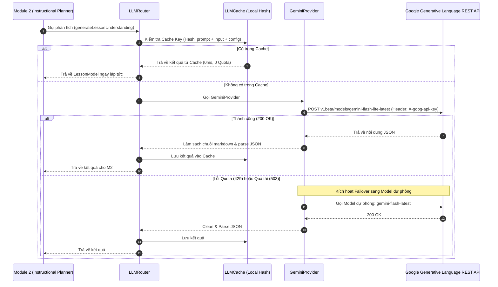

# 📐 Kiến Trúc Pipeline & Luồng Dữ Liệu Toàn Hệ Thống (CLSG-IR)

> **Tài liệu tổng hợp kỹ thuật:** Đặc tả toàn diện luồng dữ liệu (End-to-End Data Flow), kiến trúc Pipeline 4 giai đoạn, cấu trúc dữ liệu trung gian (Data Contracts), hạ tầng định tuyến LLM chịu lỗi và các ứng dụng tiêu thụ hạ nguồn của nền tảng **CLSG-IR Studio**.

---

## 1. Giới Thiệu & Triết Lý Cốt Lõi (Core Philosophy)

Các mô hình AI sinh video thông thường (Runway Gen-3, Sora) khi áp dụng vào lĩnh vực giáo dục thường gặp 3 vấn đề chí mạng:
1. **Lệch nhịp độ (Pacing Failure)**: Kịch bản nói có độ dài chênh lệch tùy tiện so với thời lượng video mong muốn, gây hiện tượng hình hết mà tiếng chưa xong hoặc ngược lại.
2. **Ảo giác thị giác (Visual Hallucination)**: AI sinh hoạt ảnh đồ họa trang trí vô bổ thay vì các sơ đồ trực quan có giá trị sư phạm chính xác.
3. **Giọng đọc đơn điệu (Monotone Audio)**: Giọng TTS đọc đều đều, thiếu vắng các khoảng dừng sinh học và nhận thức, gây quá tải nhận thức (*cognitive overload*) cho người học.

**CLSG-IR** giải quyết triệt để vấn đề này bằng cách phân tách tầng thiết kế sư phạm với tầng dựng video hạ nguồn, chuẩn hóa bài giảng thành **Bộ tứ biểu diễn trung gian 4 trụ cột**:

$$\text{CLSG-IR} = \langle \text{WHY}, \text{WHAT}, \text{HOW}, \text{WHAT TO SHOW} \rangle$$

- **WHY (Pedagogical Intent)**: Mục tiêu học tập theo thang đo Bloom và vai trò sư phạm của từng slide (*hook, definition, process, example, comparison, summary*).
- **WHAT (Narration Script)**: Lời thoại sư phạm chuẩn mực, triệt tiêu văn phong liệt kê, bảo tồn thuật ngữ chuyên ngành và khớp chuẩn ngân sách số từ ($W_{\text{target}}$).
- **HOW (Prosody & Pause Planning)**: Kế hoạch nhịp điệu với 4 loại khoảng dừng nhận thức xuất chuẩn W3C SSML.
- **WHAT TO SHOW (Visual Intent Cues)**: Chỉ dẫn thị giác được chuẩn hóa nghiêm ngặt trong **13 Canonical Taxonomies**, đồng bộ theo mốc thời gian phát âm (`trigger_timestamp_sec`).

---

## 2. Sơ Đồ Luồng Dữ Liệu Toàn Cục (End-to-End Data Flow Diagram)

```mermaid
flowchart TD
    subgraph S0 ["0. Tầng Đầu Vào & Khởi Tạo (Input & Inception)"]
        A["Tài liệu gốc: PPTX / PDF / DOCX"] --> B["Cấu hình sư phạm: UserConfiguration\n- targetDuration, WPM, learnerLevel, style"]
        A --> Cloudinary["Cloudinary CDN\n(Lưu trữ file nhị phân & cấp signed URL)"]
        A & B --> Orch["Pipeline Orchestrator\n(Master Pipeline Controller)"]
    end

    subgraph S1 ["1. Module 1: Multimodal Extraction & Visual Understanding Pipeline"]
        Orch --> M1_Factory{"Định dạng tệp?"}
        M1_Factory -->|PPTX| M1_PPTX["PPTXExtractor\n(shapes, grouped vectors, connectors, text, tables)"]
        M1_Factory -->|PDF| M1_PDF["PDFExtractor\n(PyMuPDF: text blocks, tables, images)"]
        M1_Factory -->|DOCX/MD| M1_DocxMd["DOCX / Markdown Extractor"]
        M1_PPTX & M1_PDF & M1_DocxMd --> M1_Classify["Multimodal Element Classifier\n(TEXT | IMAGE | TABLE | DIAGRAM | ANNOTATION)"]
        M1_Classify --> M1_Diagram["Diagram Recognizer & Graph Reconstruction\n- Human Pose Skeleton (17 keypoints, 19 connections)\n- Flowchart / Architecture / Process Diagrams\n- Tách Diagram Annotations (source_type=diagram_annotation)"]
        M1_Diagram --> M1_Assoc["Text–Visual Association Engine\n(Liên kết: Explanatory Text ──explains──> Diagram)"]
        M1_Assoc --> M1_IR[("Document IR (Source of Truth)\n- SlideIR[], DocumentElement[], StructuredDiagram")]
        M1_IR --> M1_Normalizer["Content Normalizer\n(Markdown LLM View: [VISUAL], lọc sạch số lẻ)"]
        M1_IR --> M1_Chunker["Multimodal Semantic Chunker\n(Tạo Semantic Chunks giàu ngữ cảnh trực quan)"]
        M1_Normalizer & M1_Chunker --> DocTree[("CanonicalDocumentTree (v2.0)\n- sections[], canonical_markdown\n- semantic_chunks[], visual_elements[], document_ir")]
    end

    subgraph S2 ["2. Module 2: Instructional Planner (Toàn Cục Bài Giảng)"]
        DocTree --> M2_LLM["LLM Router & Gateway\n(Tra cứu LLMCache trước khi gọi REST API)"]
        M2_LLM --> M2_C1["Call 1: Holistic Lesson Understanding\n(Toàn cảnh cấu trúc bài học, Big Picture)"]
        M2_C1 --> M2_C2["Call 2: Content Prioritization\n(Phân bổ trọng tâm: Core vs Secondary)"]
        M2_C2 --> M2_C3["Call 3: Teaching Arc Units\n(Gom cụm đơn vị giảng dạy, gán Bloom & Gagné)"]
        M2_C3 --> M2_Math["Deterministic Word Budgeting\n- W_target = T_target * (1 - alpha_pause) * (WPM / 60)"]
        M2_Math --> M2_Provenance["Provenance Binding\n(Gán assigned_chunk_ids & primary_visual_id)"]
        M2_Provenance --> Blueprint[("LessonBlueprint\n- sections[], assigned_chunk_ids, primary_visual_id")]
    end

    subgraph S3 ["3. Module 3: Expression Generator (Vòng Lặp Scene Đa Thể Thức)"]
        Blueprint & DocTree --> M3_Loop["Vòng lặp tuần tự từng Section kèm Grounded Semantic Chunks"]
        M3_Loop --> M3A["3A. Narration Script Generator\n- Lời thoại sư phạm khúc chiết\n- Grounded theo semantic chunks\n- Khớp W_target"]
        M3A --> M3B["3B. Prosody & Pause Planner\n- 4 loại khoảng dừng nhận thức\n- Sinh W3C SSML markup (&lt;break&gt;)"]
        M3B --> M3C["3C. Visual Intent Generator\n- Ràng buộc 13 Taxonomy chuẩn\n- Tính trigger_timestamp_sec\n- Gán visual_need & content_focus"]
        M3C --> M3D["3D. Visual–Narration Alignment\n- Ghi nhận SceneProvenanceTrace\n(scene ──> chunk ──> slide ──> visual)"]
        M3A & M3B & M3C & M3D --> DraftScenes[("CLSGScene[] (Draft Scenes)\n- narration, prosody_plan, visual_cues, provenance_trace")]
    end

    subgraph S4 ["4. Module 4: Quality, Evaluation & Safety (Hệ Thống Đánh Giá Toàn Diện)"]
        DraftScenes & Blueprint & DocTree --> M4_QA["Subsystem A: Automated QA Engine\n(5 Chiều: Content, Pedagogy, Narrative, Visual, Technical)"]
        M4_QA --> M4_Decision{"Decision Engine"}
        M4_Decision -->|PASS| VerifiedIR[("VerifiedCLSG_IR & QualityReport\n(Đạt chuẩn chất lượng, sẵn sàng phát hành)")]
        M4_Decision -->|AUTO_REPAIR\n(attempts &lt; 2)| M4_Repair["Auto-Repair Loop:\n- Co giãn pause DAR-P SSML\n- Tẩy câu rò rỉ & gạch đầu dòng\n- Quay lại Module 3"]
        M4_Repair --> M4_QA
        M4_Decision -->|NEEDS_REVIEW\n(Score thấp / Lỗi nặng)| M4_Human["Subsystem B: Human-in-the-Loop Review\n[APPROVE] [EDIT] [REGENERATE] [REJECT]\nStructured Issue Taxonomy Checklist"]
        M4_Human -->|Approved / Edited| VerifiedIR
        M4_Decision -->|FAIL| M4_Reject["Từ chối & Yêu cầu sinh lại toàn bộ"]

        VerifiedIR --> M4_Feedback["Subsystem C: User Feedback & Telemetry\n- Copy Rate, Regen Rate, Edit Rate\n- 👍/👎 Widget + Gom cụm lỗi cải tiến"]
        VerifiedIR --> M4_System["Subsystem D: System & Cost Guard\n- P50, P95, P99 Tail Latency\n- Budget Guard: Tier NORMAL vs VIP"]
        VerifiedIR --> M4_Security["Subsystem E: Privacy & Golden Dataset\n- Tenant Isolation & Prompt Injection Shield\n- Golden Dataset Regression Runner (vN vs vN+1)"]
    end

    subgraph S5 ["5. Tầng Lưu Trữ & Ứng Dụng Hạ Nguồn (Storage & Consumers)"]
        VerifiedIR --> Firestore["Firebase Firestore\n(Collection: 'projects')"]
        VerifiedIR --> UIStudio["Studio Workspace 5 Tabs\n(M1 Doc Tree, M2 Blueprint, M3 Script/SSML, M3 Visuals, M4 Guard & Review)"]
        VerifiedIR --> Sim["Video Preview Simulator\n(Web Speech API + Visual Timeline)"]
        VerifiedIR --> Exporter["Export Engine\n(.json, SSML .xml, Script .txt)"]
    end
```

---

## 3. Chi Tiết Từng Giai Đoạn Trong Pipeline

### Giai Đoạn 0: Khởi Tạo Dự Án & Cấu Hình Sư Phạm
- **Đầu vào**: Tệp slide/tài liệu (`.pptx`, `.pdf`, `.docx`) cùng đối tượng cấu hình `UserConfiguration`:
  - `targetDurationSeconds`: Tổng thời lượng bài giảng mong muốn (mặc định 180s hoặc tự động tính theo số slide).
  - `targetWpm`: Tốc độ nói mục tiêu (chuẩn 140 WPM).
  - `narrationStyle`: Phong cách giảng dạy (`conversational`, `academic`, `concise`, `engaging`).
  - `learnerLevel`: Trình độ học viên (`beginner`, `intermediate`, `advanced`).
  - `narration_language`: Ngôn ngữ thuyết minh (mặc định `vi` - Tiếng Việt).
- **Lưu trữ nhị phân**: Tệp tải lên được đẩy trực tiếp lên **Cloudinary CDN** để lấy URL công khai an toàn; thông tin dự án được khởi tạo trên **Firebase Firestore** với trạng thái ban đầu `processing`.

---

### Giai Đoạn 1: Module 1 – Content Extractor (0-LLM, Rule-Based)
*Mã nguồn thực thi: `src/pipeline/module1_extractor/`*

- **Nguyên lý thiết kế**: Hoạt động **thuần thuật toán (0-LLM, 0-VLM)** nhằm đảm bảo độ trễ cực thấp (< 50ms) và chi phí vận hành $0.
- **Quy trình xử lý**:
  1. **Bóc tách theo định dạng**:
     - **PPTX**: Sử dụng thư viện `jszip` giải nén và phân tích cấu trúc XML (`ppt/slides/slide*.xml`). Tách khối chữ, bảng biểu (`a:tbl`), hình dạng hình học và ghi chú diễn giả (`ppt/notesSlides/notesSlide*.xml`).
     - **PDF**: Dùng `pdfjs-dist` trích xuất tầng text layer, gom cụm dòng theo tọa độ hình học $(x, y, w, h)$, phân loại tiêu đề và nội dung theo font-size.
  2. **Bộ lọc Metadata Cleaner**:
     - Dùng biểu thức chính quy (Regex) quét sạch các chuỗi sinh tự động từ template như `aicb-*`, `slide-placeholder`, ngày giờ in ấn, số trang thừa.
- **Cấu trúc dữ liệu đầu ra**: `CanonicalDocumentTree`

```typescript
interface CanonicalDocumentTree {
  document_id: string;
  title: string;
  file_type: 'pptx' | 'pdf' | 'docx' | 'unknown';
  total_sections: number;
  total_word_count: number;
  extraction_time_ms: number;
  sections: Array<{
    section_id: string;          // Ví dụ: "sec_1", "sec_2"
    order: number;               // Thứ tự slide (1, 2, ...)
    title: string;               // Tiêu đề slide
    raw_text: string;            // Nội dung chữ gốc đã làm sạch
    visual_elements: Array<{     // Các phần tử đồ họa phát hiện được
      type: 'image' | 'chart' | 'diagram' | 'shape';
      description?: string;
    }>;
    table_elements: Array<{      // Các bảng biểu
      rows: string[][];
    }>;
  }>;
}
```

---

### Giai Đoạn 2: Module 2 – Instructional Planner (Toàn Cục Bài Giảng)
*Mã nguồn thực thi: `src/pipeline/module2_planner/`*

Thay vì xử lý cục bộ từng slide độc lập, Module 2 thực hiện **Semantic Whole-Lesson Reasoning** qua 3 cuộc gọi LLM có cấu trúc kết hợp 1 thuật toán phân bổ ngân sách tất định:

```
[CanonicalDocumentTree]
         │
         ▼
[Call 1: Lesson Understanding] ──► LessonModel (Mục tiêu cốt lõi, Đồ thị khái niệm Core Concepts)
         │
         ▼
[Call 2: Content Prioritization] ──► Phân loại: Core, Supporting, Example, Context, Noise Items
         │
         ▼
[Call 3: Teaching Arc Units]    ──► TeachingUnit[] (Gom nhóm multi-slide, định hình trọng tâm)
         │
         ▼
[Deterministic Budgeting (0-LLM)] ──► Phân bổ thời lượng giây và W_target cho từng slide
         │
         ▼
[Narrative Planning Service]     ──► SlideAnalysis & NarrativePlan (Cầu nối logic chuyển tiếp)
         │
         ▼
[LessonBlueprint]
```

#### Chi tiết 3 cuộc gọi LLM trong M2:
1. **Call 1: `generateLessonUnderstanding`**:
   - Khảo sát toàn bộ dàn bài để suy diễn: Mục tiêu sư phạm trung tâm, vấn đề lớn cần giải quyết, đồ thị khái niệm (`core_concepts` có quan hệ tiên quyết `prerequisites`), và chân dung người học (`learning_needs`).
2. **Call 2: `generateContentPrioritization`**:
   - Phân loại toàn bộ các slide/ý thành 5 nhóm kiến thức:
     - `Core`: Trọng tâm bắt buộc giải thích sâu.
     - `Supporting`: Kiến thức bổ trợ.
     - `Example`: Ví dụ minh họa thực tiễn.
     - `Context`: Bối cảnh mở đầu.
     - `Noise Items`: Slide rác, thông báo hành chính cần lược bỏ khỏi kịch bản thuyết minh.
3. **Call 3: `generateTeachingPlan`**:
   - Gom các slide liên quan thành các cụm đơn vị giảng dạy đa slide (**Teaching Units**), phân bổ nhịp độ cho từng cụm.

#### Phân bổ ngân sách thời gian & số từ tất định (Deterministic 0-LLM Budgeting):
$$\text{NetSpeakingSec} = \text{TargetDuration} \times (1.0 - \text{PauseFactor})$$
*(Trong đó $\text{PauseFactor} = 0.18$ cho chuẩn, $0.20$ cho phong cách hội thoại, $0.24$ khi giải thích chậm).*

$$W_{\text{target}} = \text{NetSpeakingSec} \times \frac{\text{WPM}}{60}$$

Ngân sách từ và thời gian được phân phối cho từng slide dựa trên **Vai trò sư phạm (SlideRole)** và **Mức độ nhận thức Bloom**:
- `CORE_CONCEPT` / `PROCESS`: Hệ số trọng số $1.2 - 1.4$
- `HOOK` / `EXAMPLE`: Hệ số trọng số $1.0$
- `SUMMARY` / `COMPARISON`: Hệ số trọng số $0.8 - 0.9$
- `DECORATIVE` (Slide chuyển mục): Giới hạn nghiêm ngặt $15 - 25$ từ, thời lượng $10 - 15$ giây.

- **Cấu trúc dữ liệu đầu ra**: `LessonBlueprint`

---

### Giai Đoạn 3: Module 3 – Expression Generator (Đa Thể Thức)
*Mã nguồn thực thi: `src/pipeline/module3_generator/`*

Module 3 thực hiện vòng lặp qua từng section trong `LessonBlueprint`, duy trì một **Global Narrative Context** (lưu trữ danh sách câu mở đầu đã dùng, thuật ngữ đã xuất hiện, kế hoạch slide trước và slide sau) nhằm sinh đồng thời 3 thành phần cho mỗi Scene:

#### 3A. Narration Script Generator (WHAT - Kịch Bản Lời Thoại)
- **Chuẩn hóa ngôn ngữ**: Tiếng Việt giảng dạy khúc chiết, truyền cảm, tự nhiên như giảng viên đại học.
- **Bảo tồn thuật ngữ tiếng Anh**: Sử dụng `technicalTerminologyService` để giữ nguyên chuẩn các thuật ngữ quốc tế (ví dụ: *Convolutional Layer*, *Feature Map*, *Kernel*, *Pooling*, *Stride*, *Backpropagation*).
- **Anti-Listicle**: Triệt tiêu hoàn toàn lối mở đầu liệt kê máy móc (*"Thứ nhất là... Thứ hai là..."*), thay bằng các liên kết suy luận tự nhiên (*"Để giải quyết thách thức này...", "Quan sát vào sơ đồ ta thấy..."*).
- **Bám sát $W_{\text{target}}$**: Chiều dài kịch bản nói kiểm soát chặt chẽ theo ngân sách từ đã tính.

#### 3B. Prosody & Pause Planner (HOW - Kế Hoạch Nhịp Điệu Pre-TTS)
Phân tách lời thoại thành từng câu (`NarrationSentence`) và chèn **4 loại khoảng dừng nhận thức** theo chuẩn W3C SSML:
1. **Micro-pause** (`150ms - 250ms`): Ngắt nhịp giữa các mệnh đề cú pháp trong câu dài.
2. **Emphasis-pause** (`300ms - 450ms`): Dừng trước hoặc sau thuật ngữ kỹ thuật cốt lõi.
3. **Concept Boundary Pause** (`500ms - 700ms`): Dừng sau một định nghĩa hoặc công thức toán học để học viên kịp tiếp thu.
4. **Section Transition Pause** (`800ms - 1200ms`): Dừng cuối slide trước khi chuyển cảnh tiếp theo.

*Mã SSML sinh ra*:
```xml
<speak>
  Mạng nơ-ron tích chập <break time="300ms"/> Convolutional Neural Network <break time="200ms"/>
  là kiến trúc nền tảng cho thị giác máy tính. <break time="600ms"/>
</speak>
```

#### 3C. Visual Intent Generator (WHAT TO SHOW - Ý Đồ Thị Giác)
Ràng buộc tuyệt đối vào **13 Phân loại Thị giác Chuẩn (13 Canonical Taxonomies)**:
> `diagram`, `flowchart`, `comparison`, `infographic`, `chart`, `table`, `screenshot`, `illustration`, `real_world_example`, `timeline`, `equation`, `process_visualization`, `concept_map`.

- Tính toán mốc kích hoạt chính xác (`trigger_timestamp_sec`) đồng bộ với từng câu trong file âm thanh.
- Gắn nhãn mục đích sư phạm (`visual_purpose`) và lý do giáo dục bắt buộc (`pedagogical_necessity`).

- **Cấu trúc dữ liệu đầu ra**: `CLSGScene[]` (Draft Scenes).

---

### Giai Đoạn 4: Module 4 – Quality & Visual Guard (Kiểm Định & Sửa Lỗi Tự Động)
*Mã nguồn thực thi: `src/pipeline/module4_guard/`*

Module 4 đóng vai trò người gác cổng chất lượng, thực hiện 4 bài kiểm tra tự động trước khi cấp chứng chỉ:

```
[Draft Scenes] + [LessonBlueprint] + [CanonicalDocumentTree]
                           │
                           ▼
            ┌─────────────────────────────┐
            │    Module 4 Quality Guard   │
            └──────────────┬──────────────┘
                           │
    ┌──────────────────────┼──────────────────────┐
    ▼                      ▼                      ▼
[1. DAR-P Validation]  [2. Taxonomy Check]  [3. Metadata Audit]
|T_act - T_tgt| / T_tgt   100% thuộc 13 nhóm     Quét regex aicb-*,
       <= 15%              chuẩn hóa             placeholder rác
    │                      │                      │
    │ (Lệch 5%-25%)        │                      │ (Nếu phát hiện)
    ▼                      │                      ▼
[Auto-Repair: Cân chỉnh    │               [Auto-Repair: Redact
 lại pause coefficients]   │                chuỗi rác khỏi script]
    │                      │                      │
    └──────────────────────┼──────────────────────┘
                           │
                           ▼
              [VerifiedCLSG_IR & QualityReport]
```

1. **Kiểm tra độ bám sát thời lượng (DAR-P - Duration Adherence Rate with Prosody)**:
   $$\text{ErrorRatio} = \frac{|T_{\text{actual}} - T_{\text{target}}|}{T_{\text{target}}}$$
   - Nếu $\text{ErrorRatio} \le 15\%$: Đạt chuẩn `PASSED`.
   - **Auto-Repair (Tự cân chỉnh)**: Nếu sai số nằm trong khoảng $5\% < \text{ErrorRatio} \le 25\%$, hệ thống tự động nhân tỷ lệ `scaleFactor = T_target / T_actual` vào toàn bộ thời lượng khoảng dừng SSML, đưa thời lượng về sát mốc mà không làm hỏng cấu trúc câu thoại.
2. **Kiểm tra Phân loại Thị giác**: Đảm bảo 100% visual cues thuộc danh mục 13 taxonomy chuẩn.
3. **Kiểm tra Nhu cầu Sư phạm Thị giác (Necessity Check)**: Loại bỏ các cue vô bổ, đảm bảo mọi hoạt ảnh hiển thị đều có lý do giáo dục rõ ràng.
4. **Kiểm tra Rò rỉ Siêu dữ liệu (Metadata Leakage Audit)**: Quét và khử sạch triệt để các chuỗi `aicb-*` còn sót lại.

- **Cấu trúc dữ liệu đầu ra**: `VerifiedCLSG_IR` chính thức kèm `QualityReport` (chứa điểm chất lượng tổng thể `0.0 - 1.0` và danh sách auto-repair đã thực hiện).

---

## 4. Hạ Tầng Định Tuyến LLM & Khả Năng Kháng Lỗi (LLM Infrastructure)

*Mã nguồn thực thi: `src/services/llm/`*

Hệ thống giao tiếp trực tiếp với **Google Generative AI REST API** qua hạ tầng tự bảo vệ 4 tầng:



### Các cơ chế chịu lỗi cốt lõi:
1. **Bộ nhớ đệm thông minh (`LLMCache`)**: Băm (Hash) nội dung văn bản đầu vào, tham số sư phạm và phiên bản prompt. Khi người dùng chạy lại cùng một file, kết quả được nạp lại tức thì, tiết kiệm 100% quota và độ trễ = 0.
2. **Chuỗi dự phòng mô hình (Model Failover Chain)**:
   - Ưu tiên 1: `gemini-flash-lite-latest` (Tối ưu tốc độ, quota cao, phản hồi nhanh).
   - Dự phòng 1: `gemini-flash-latest`.
   - Dự phòng 2: `gemini-3.5-flash`.
   - Dự phòng 3: `gemini-2.0-flash`.
3. **Cơ chế chống Timeout & Truncation**:
   - Sử dụng `AbortController` với thời gian chờ tối đa **90 giây**.
   - Văn bản slide gửi vào các prompt toàn cục được rút gọn thông minh tối đa 300 ký tự/slide để vừa đủ ngữ cảnh mà không làm quá tải token ngữ cảnh.
4. **Cập nhật API Key tức thì (`apiKeyService`)**:
   - Người dùng có thể điền Gemini API Key cá nhân từ modal trên giao diện; `GeminiProvider` tự động lắng nghe và áp dụng ngay mà không cần reload trang.

---

## 5. Bảng Tổng Hợp Hợp Đồng Dữ Liệu (Data Contracts)

| Chặng | Đầu Vào (Input) | Bộ Xử Lý (Processor) | Đầu Ra (Output Contract) | Tiêu Chuẩn Kiểm Soát |
| :---: | :--- | :--- | :--- | :--- |
| **M1** | File PPTX / PDF / DOCX | `PPTXExtractor` / `PDFExtractor` | `CanonicalDocumentTree` | 0-LLM, sạch metadata rác, < 50ms |
| **M2** | `CanonicalDocumentTree` + `UserConfiguration` | `InstructionalPlanner` + `LLMRouter` | `LessonBlueprint` | 3 bước toàn cục, tính toán $W_{\text{target}}$ |
| **M3A** | `SectionPlan` + `LessonModel` | `NarrationGenerator` | `NarrationScript` | Tiếng Việt sư phạm, giữ thuật ngữ Anh, không liệt kê |
| **M3B** | `NarrationScript` + `SectionPlan` | `ProsodyPlanner` | `ProsodyPlan` (W3C SSML) | 4 loại khoảng dừng nhận thức |
| **M3C** | `SectionPlan` + `ProsodyPlan` | `VisualIntentGenerator` | `VisualCue[]` | 100% thuộc 13 taxonomy, trigger timestamp chính xác |
| **M4** | `CLSGScene[]` + `LessonBlueprint` | `QualityVisualGuard` | `VerifiedCLSG_IR` + `QualityReport` | DAR-P $\le 15\%$, tự động sửa khoảng dừng và rò rỉ |

---

## 6. Tầng Lưu Trữ & Ứng Dụng Hạ Nguồn (Downstream Consumers)

Khi `PipelineOrchestrator` phát hành kết quả hoàn tất `PipelineExecutionResult`, dữ liệu phục vụ các thành phần:

1. **Firebase Firestore (`projects/{projectId}`)**: Lưu trữ vĩnh viễn trạng thái `ready` cùng toàn bộ payload IR để người dùng truy cập lại từ danh sách Dashboard.
2. **Studio Workspace Tabs**: Cho phép người dùng quan sát và biên tập trực tiếp từng chặng qua 5 Tab:
   - *Tab 1: Cấu trúc tài liệu (M1 Doc Tree)*
   - *Tab 2: Bản thiết kế sư phạm (M2 Blueprint)*
   - *Tab 3: Lời thoại & Khoảng dừng (M3 Script & SSML)*
   - *Tab 4: Ý đồ thị giác sư phạm (M3 Visuals)*
   - *Tab 5: Báo cáo kiểm định chất lượng (M4 Guard Report)*
3. **Video Preview Simulator**: Phát thử nghiệm bài giảng thời gian thực: Web Speech API đọc từng câu thuyết minh, đồng thời kích hoạt hiển thị thẻ thị giác đúng vào mốc `trigger_timestamp_sec`.
4. **Export Engine**: Xuất file chuẩn hóa `CLSG-IR.json` cho các công cụ render video tự động (Remotion, Manim, MoviePy) hoặc xuất file `.xml` kịch bản SSML cho các hệ thống TTS chuyên nghiệp (ElevenLabs, Azure Speech).
