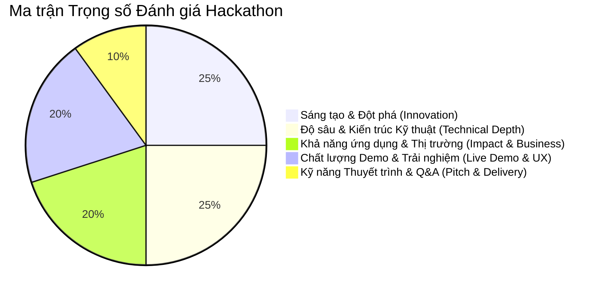
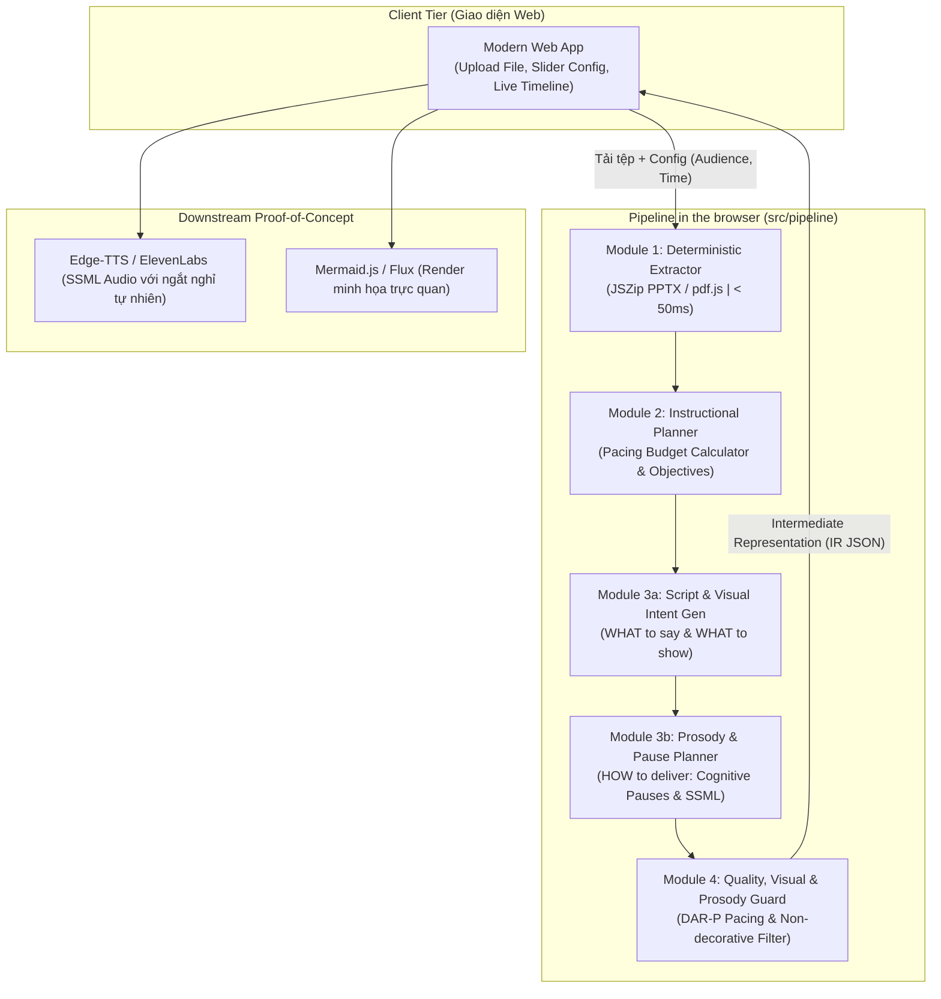

# CẨM NANG TOÀN DIỆN: QUY TRÌNH ĐƯA DỰ ÁN CLSG-IR VÀO HACKATHON
## (CLSG-IR / EduTailor Hackathon Battle Playbook)

> **Dự án:** CLSG-IR (Configurable Lecture Script & Visual Intent Generation)  
> **Định vị:** Lớp biểu diễn trung gian (IR) Sư phạm & Ý định Trực quan làm cầu nối cho AI Video Generation  
> **Mục tiêu:** Tối đa hóa cơ hội đạt giải Quán quân / Top giải thưởng tại các cuộc thi Hackathon công nghệ (GenAI, EdTech, Open Innovation).

---

## MỤC LỤC

1. [Chiến Lược Định Vị & Lựa Chọn Track Dự Thi](#1-chiến-lược-định-vị--lựa-chọn-track-dự-thi)
2. [Giải Mã Tiêu Chí Chấm Giải (Rubric Alignment)](#2-giải-mã-tiêu-chí-chấm-giải-rubric-alignment)
3. [Lộ Trình Tác Chiến 48 Giờ (Hour-by-Hour Battle Roadmap)](#3-lộ-trình-tác-chiến-48-giờ-hour-by-hour-battle-roadmap)
4. [Kiến Trúc Kỹ Thuật Bản MVP Hackathon (Lean Implementation)](#4-kiến-trúc-kỹ-thuật-bản-mvp-hackathon-lean-implementation)
5. [Thiết Kế Giao Diện & Kịch Bản Demo Trực Quan (Interactive Demo)](#5-thiết-kế-giao-diện--kịch-bản-demo-trực-quan-interactive-demo)
6. [Cấu Trúc Pitch Deck 10 Slide & Kịch Bản Thuyết Trình 3 Phút](#6-cấu-trúc-pitch-deck-10-slide--kịch-bản-thuyết-trình-3-phút)
7. [Bộ Câu Hỏi Phản Biện & Chiến Thuật Phòng Thủ Trước BGK (Q&A Defense)](#7-bộ-câu-hỏi-phản-biện--chiến-thuật-phòng-thủ-trước-bgk-qa-defense)
8. [Checklist Nghiệm Thu Trước Giờ G (Submission Checklist)](#8-checklist-nghiệm-thu-trước-giờ-g-submission-checklist)

---

## 1. CHIẾN LƯỢC ĐỊNH VỊ & LỰA CHỌN TRACK DỰ THI

### 1.1. Bản đồ định vị sản phẩm (Value Proposition Canvas)
* **Vấn đề cốt lõi (Pain Point):**
  - Các mô hình sinh video AI hàng đầu (Sora, Runway, LTX-Video, HeyGen) tạo ra hình ảnh mãn nhãn nhưng **hoàn toàn mù về mặt sư phạm (Pedagogically Blind)**.
  - Các công trình học thuật như **EduCraft (CIKM 2025)** đọc ảnh slide bằng Vision-Language Model (VLM): cực kỳ chậm, tốn kém chi phí tính toán ($), trói buộc 1 slide = 1 script, và hay sinh visual mang tính trang trí vô bổ.
* **Giải pháp đột phá (Breakthrough Solution):**
  - **CLSG-IR** hoạt động như một **Compiler cho giáo dục**: nhận tài liệu thô (PPTX/DOCX), biên dịch thành **Lớp biểu diễn trung gian (IR)** chuẩn hóa gồm **Lời giảng tự nhiên (Spoken Narration)** và **Siêu dữ liệu trực quan (Visual Intent Metadata)**.
  - Tối ưu 100% cho nhận thức người học (Cognitive-driven), không sinh visual trang trí.
  - Co giãn linh hoạt theo đối tượng (K-12, Đại học, Chuyên gia) và ngân sách thời lượng (WPM Pacing).

### 1.2. Chọn Track dự thi tối ưu
| Track dự thi | Góc tiếp cận (Angle) | Điểm nhấn cần làm nổi bật |
| :--- | :--- | :--- |
| **Generative AI & LLMs** | Hệ thống Multi-Stage Pipeline & Structured Outputs | Kiến trúc 4 Module, Zero-Vision AST Parser, Pydantic Schema, Feedback Loop tự sửa lỗi |
| **EdTech / Future of Work** | Cá nhân hóa giáo dục trên quy mô lớn | Chuyển đổi giáo trình tĩnh thành video bài giảng sinh động, phổ cập giáo dục chất lượng cao |
| **Developer Tools / Infra** | Middleware / Headless Educational Engine | Cung cấp REST/JSON API sạch sẽ cho mọi nền tảng Video Gen, LMS hoặc Avatar AI tích hợp |

---

## 2. GIẢI MÃ TIÊU CHÍ CHẤM GIẢI (RUBRIC ALIGNMENT)

Ban giám khảo Hackathon thường chấm theo 5 trụ cột chính với thang điểm tương đương:



1. **Innovation (25%):** Đưa ra khái niệm mới: *Pedagogical Intermediate Representation (IR)* và bộ *13 Visual Taxonomies*. Khẳng định sự vượt trội so với baseline EduCraft (CIKM 2025).
2. **Technical Depth (25%):** Pipeline chạy thực tế, không hardcode. Trích xuất tài liệu siêu tốc (<100ms), Structured Output JSON chuẩn chỉ, cơ chế Pacing Guard tự động điều chỉnh độ dài.
3. **Impact & Feasibility (20%):** Giảm chi phí sản xuất bài giảng video từ $500/video xuống < $0.50/video; rút ngắn thời gian từ 3 ngày xuống 30 giây.
4. **Live Demo & UX (20%):** Giao diện tương tác trực quan, hiển thị timeline lời thoại, badge sư phạm, và render trực tiếp visual cue (Mermaid chart / ảnh sinh động).
5. **Pitch & Delivery (10%):** Câu chuyện hấp dẫn, đúng giờ (3 - 5 phút), trả lời phản biện gãy gọn.

---

## 3. LỘ TRÌNH TÁC CHIẾN 48 GIỜ (HOUR-BY-HOUR BATTLE ROADMAP)

```
00h ───────── 06h ───────── 18h ───────── 30h ───────── 42h ───── 48h
 ├─ Khởi động  ├─ Core AI    ├─ Web Demo   ├─ Wow & Pol  ├─ Pitch &
 │  & Setup    │  Pipeline   │  & Timeline │  Integration│  Submit
```

### Chặng 1: Khởi động & Khóa phạm vi (Giờ 00 - 06)
- [ ] Chốt tên thương mại: **EduTailor (Powered by CLSG-IR)**.
- [ ] Phân vai trò trong team:
  - **Member 1 (AI / Backend Lead):** Phụ trách Core Pipeline (Module 1 - 4) và Prompt Engineering.
  - **Member 2 (Frontend / Fullstack):** Xây dựng Web App tương tác (Next.js/React hoặc Streamlit/HTML-JS).
  - **Member 3 (Product / Pitch Lead):** Soạn thảo Pitch Deck, kịch bản Demo, chuẩn bị tài liệu mẫu (Slide PPTX demo cực chuẩn).
- [ ] Setup Repository GitHub, tạo cấu trúc thư mục, thống nhất hợp đồng API JSON Schema giữa Frontend và Backend.

### Chặng 2: Hoàn thiện Core AI Pipeline (Giờ 06 - 18)
- [ ] Viết `extractor.py`: Dùng `python-pptx` và `python-docx` bóc tách text thuần thành `DocumentTree` (tuyệt đối không dùng OCR/VLM để giữ tốc độ < 100ms).
- [ ] Cấu hình `planner.py`: Tính $W_{\text{target}} = \text{Duration} \times 140$ từ/phút, phân chia section theo tiến trình sư phạm.
- [ ] Xây dựng `generator.py`: Module 3a sinh kịch bản và 13 Visual Taxonomies với Pydantic Output.
- [ ] Xây dựng `prosody_planner.py`: Module 3b chèn khoảng dừng nhận thức (`cognitive_pause`), khoảng dừng đồng bộ thị giác (`visual_sync_pause`) và xuất thẻ SSML.
- [ ] Cài đặt `guard.py`: Kiểm tra chỉ số $DAR-P$ (tính cả thời gian ngắt nghỉ), nếu lệch > 15% kích hoạt vòng lặp prompt điều chỉnh.

### Chặng 3: Xây dựng Giao diện Web tương tác (Giờ 18 - 30)
- [ ] Khu vực tải tệp: Drag & drop file PPTX, DOCX.
- [ ] Bộ điều khiển sư phạm: Slider thời lượng (3m, 5m, 10m), Dropdown đối tượng (K-12, University, Enterprise), Phong cách (Casual, Academic).
- [ ] Màn hình kết quả: Interactive Timeline trực quan, thẻ Section, hiển thị badge ngữ điệu, lời thoại có nút nghe thử TTS với các khoảng dừng chân thực.
- [ ] Thẻ Visual Cue: Render ngay biểu đồ (Mermaid.js cho flowchart/diagram, SVG hoặc ảnh sinh qua Flux/DALL-E).

### Chặng 4: Tạo "Hiệu Ứng WOW" & Tích hợp Hoàn chỉnh (Giờ 30 - 42)
- [ ] **Tạo Video mẫu End-to-End dài 45s:** Kết hợp âm thanh TTS biểu cảm có ngắt nghỉ chuẩn mực + ảnh minh họa từ visual cues để chứng minh khả năng nối tầng với video engine.
- [ ] **Màn so sánh Trước & Sau (Before vs. After):** Slide PPTX thô $\rightarrow$ Script đọc khô khan không ngắt nghỉ của baseline vs. Bài giảng lôi cuốn + Visual chuẩn + Ngữ điệu sư phạm của CLSG-IR.
- [ ] Bật chế độ offline/fallback (Lưu sẵn 2 bộ cache kết quả phòng khi API mạng bị lag lúc trình diễn).

### Chặng 5: Đóng gói, Pitch Deck & Luyện tập Thuyết trình (Giờ 42 - 48)
- [ ] Thiết kế Slide Pitch Deck (Tối đa 10 slide, visual đẹp, ít chữ).
- [ ] Quay 1 video demo màn hình 2 phút dự phòng (Back-up Video Demo).
- [ ] Viết `README.md` chuẩn hội nghị, đính kèm ảnh kiến trúc `clsg_pipeline_architecture.png`.
- [ ] Luyện tập tổng duyệt kịch bản thuyết trình (Rehearsal) đúng 3 phút 00 giây.

---

## 4. KIẾN TRÚC KỸ THUẬT BẢN MVP HACKATHON (LEAN IMPLEMENTATION)

Để đảm bảo chạy ổn định trong môi trường Hackathon, kiến trúc được tinh gọn như sau:



### JSON Schema chuẩn trao đổi giữa Frontend & Backend:
```json
{
  "project_title": "Nhập môn Mạng Nơ-ron Nhân tạo",
  "target_audience": "university",
  "target_duration_minutes": 5,
  "total_sections": 3,
  "metrics": {
    "target_words": 700,
    "actual_words": 685,
    "duration_adherence_rate": 0.978,
    "visual_cues_count": 4
  },
  "sections": [
    {
      "section_id": "sec_01",
      "topic": "Khái niệm Perceptron và Hàm kích hoạt",
      "learning_goal": "Người học giải thích được cơ chế tổng có trọng số và vai trò phi tuyến tính của Activation Function.",
      "narration": "Hãy hình dung một tế bào thần kinh sinh học nhận tín hiệu từ nhiều nhánh... [Lời thoại phong cách nói trực tiếp]",
      "visual_cues": [
        {
          "visual_need": true,
          "visual_type": "process_visualization",
          "visual_purpose": "Minh họa dòng chảy dữ liệu từ Inputs -> Trọng số W -> Hàm Sum -> Activation -> Output",
          "content_focus": "Sơ đồ luồng tính toán của một Perceptron đơn lẻ",
          "learning_support": "Giải quyết điểm nghẽn nhận thức: làm sao các con số biến thành quyết định nhị phân.",
          "importance_level": "high"
        }
      ]
    }
  ]
}
```

---

## 5. THIẾT KẾ GIAO DIỆN & KỊCH BẢN DEMO TRỰC QUAN (INTERACTIVE DEMO)

### 5.1. Bố cục màn hình ứng dụng (3-Column Layout)
1. **Cột 1 (Input & Hyperparameters):**
   - Hộp kéo thả file: Hỗ trợ tệp `.pptx`, `.docx`.
   - Lựa chọn trình độ: `Học sinh THPT`, `Sinh viên ĐH`, `Kỹ sư/Chuyên gia`.
   - Thanh trượt thời lượng: `3 phút` (420 từ), `5 phút` (700 từ), `10 phút` (1400 từ).
   - Nút hành động: Nổi bật với hiệu ứng phát sáng gradient **"Compile to Pedagogical IR"**.
2. **Cột 2 (The Spoken Narrative Flow):**
   - Danh sách section hiển thị dạng thẻ card dọc.
   - Thẻ hiển thị rõ: Mục tiêu học tập (Bloom's Taxonomy), đoạn lời giảng tự nhiên (`narration`).
   - Có nút **Play Audio** tích hợp TTS để phát giọng đọc giảng viên truyền cảm.
3. **Cột 3 (Visual Intent & Live Rendering):**
   - Thẻ hiển thị ý định trực quan ứng với từng phân đoạn.
   - Hiển thị badge loại hình ảnh: `diagram`, `flowchart`, `comparison`,...
   - Khu vực preview sống động:
     - Nếu là `flowchart`/`diagram` $\rightarrow$ Tự động vẽ ra sơ đồ logic tương tác bằng Mermaid.
     - Nếu là `real_world_example` $\rightarrow$ Hiển thị ảnh minh họa chuẩn xác.

### 5.2. Kịch bản trình diễn Live 90 giây (The Wow Flow)
1. **Giây 00 - 15:** Kéo thả một file PPTX nhiều chữ, phức tạp về bài toán Kỹ thuật/Y học vào giao diện.
2. **Giây 15 - 30:** Chọn thông số: *"Tôi muốn giảng cho sinh viên năm nhất trong đúng 3 phút"*. Nhấn **Compile**.
3. **Giây 30 - 50:** Trong vòng **3 đến 5 giây**, toàn bộ kịch bản xuất hiện! Chỉ ra cho BGK thấy:
   - Hệ thống không đọc lại slide mà viết lại thành văn phong nói sư phạm giàu tính dẫn dắt.
   - Hệ số $DAR = 98\%$ (chính xác từng giây phát sóng).
4. **Giây 50 - 75:** Cuộn tới thẻ Visual Intent: *"Hãy nhìn vào đây, hệ thống không gợi ý hình ảnh trang trí bừa bãi. Nó chỉ định một `process_visualization` kèm lý do sư phạm cụ thể"*. Bấm render sơ đồ luồng trực tiếp.
5. **Giây 75 - 90:** Bấm phát đoạn audio TTS đọc lời giảng ăn khớp với sơ đồ hình ảnh.

> [!TIP]
> **Chiến thuật Failsafe (Chống sự cố mạng):** Chuẩn bị sẵn nút **"Load Sample Demo (Pre-cached)"** trên thanh điều hướng. Nếu mạng hội trường yếu hoặc API LLM bị quá tải, bấm ngay nút này để nạp dữ liệu tức thì mà không bị gián đoạn bài thuyết trình.

---

## 6. CẤU TRÚC PITCH DECK 10 SLIDE & KỊCH BẢN THUYẾT TRÌNH 3 PHÚT

```
SLIDE 1: Title & Hook (EduTailor: The Pedagogical Brain for AI Video)
SLIDE 2: The Problem (AI Video is Gorgeous, but Pedagogically Blind)
SLIDE 3: The Gap (EduCraft is Slow, Costly, Slide-Bound & Decorative)
SLIDE 4: The Breakthrough (CLSG-IR: Intermediate Representation)
SLIDE 5: Architecture (Zero-Vision AST + Planner + Guard Loop)
SLIDE 6: LIVE DEMO (The 90-Second Miracle)
SLIDE 7: Evaluation & Metrics (DAR 98%, TCR 100%, 95% Cost Reduction)
SLIDE 8: Downstream Ecosystem (Bridge to Sora, Runway, HeyGen, LMS)
SLIDE 9: Market & Business Model (B2B API for EdTech & Course Creators)
SLIDE 10: Team & Vision (Revolutionizing Education with Scalable AI)
```

### Kịch bản thuyết trình từng giây (3 Phút):
* **[0:00 - 0:35] Mở đầu ấn tượng:**  
  *"Kính thưa Ban giám khảo, chúng ta đang sống trong kỷ nguyên bùng nổ của AI Video với Sora, Runway, HeyGen. Nhưng nếu quý vị đưa một slide bài giảng toán hay lập trình vào các mô hình này, kết quả nhận được chỉ là những thước phim đẹp mắt nhưng **hoàn toàn mù về mặt sư phạm**! Chúng không biết khi nào học sinh cần xem lưu đồ, khi nào cần xem công thức và khi nào chỉ cần tập trung nghe giảng. Đó là lý do hôm nay chúng tôi mang đến **EduTailor**."*
* **[0:35 - 1:10] Đột phá công nghệ:**  
  *"Thay vì dùng các mô hình thị giác nặng nề như EduCraft CIKM 2025 vừa đắt vừa chậm, chúng tôi sáng tạo ra **CLSG-IR** – Lớp biểu diễn trung gian sư phạm đầu tiên. Với bộ bóc tách Zero-Vision AST siêu tốc dưới 50ms, bộ lập lịch kiểm soát nhịp độ nói chính xác 140 từ/phút, và bảng 13 chuẩn phân loại thị giác bài trừ hình ảnh trang trí vô bổ."*
* **[1:10 - 2:20] Live Demo:**  
  *(Thực hiện các bước theo kịch bản ở Mục 5.2 - Thao tác dứt khoát, để âm thanh TTS vang lên 5 giây).*
* **[2:20 - 2:45] Con số & Tác động thương mại:**  
  *"Với EduTailor, chúng tôi giảm 95% chi phí tính toán so với cách tiếp cận cũ, đảm bảo độ chính xác thời lượng đạt trên 95%. Thị trường mục tiêu là các nền tảng EdTech, trường đại học và hàng triệu nhà sáng tạo nội dung giáo dục."*
* **[2:45 - 3:00] Kết luận & Kêu gọi:**  
  *"EduTailor không chỉ tạo ra kịch bản, chúng tôi đang xây dựng bộ não sư phạm cho thế hệ video giáo dục tiếp theo. Xin cảm ơn Ban giám khảo!"*

---

## 7. BỘ CÂU HỎI PHẢN BIỆN & CHIẾN THUẬT PHÒNG THỦ TRƯỚC BGK (Q&A DEFENSE)

### Q1: Tại sao không dùng trực tiếp GPT-4o đọc file rồi bảo nó sinh kịch bản cho xong?
> **Trả lời:** *"GPT-4o khi prompt thông thường gặp 3 điểm yếu chí mạng:
> 1. Không kiểm soát được thời lượng (nói lan man hoặc quá ngắn, vi phạm nhịp độ chuẩn 140 từ/phút).
> 2. Có xu hướng mô tả hình ảnh trang trí nghệ thuật thay vì tập trung vào điểm nghẽn nhận thức của học sinh.
> 3. Không có cấu trúc dữ liệu chuẩn mực để tích hợp tự động vào downstream video rendering engine. CLSG-IR sử dụng kiến trúc 4 tầng với Pydantic JSON Schema và Quality Guard Loop để giải quyết triệt để 3 vấn đề này."*

### Q2: Tại sao lại gọi là Zero-Vision Extractor? Không nhìn slide thì sao hiểu được hình ảnh có sẵn?
> **Trả lời:** *"Nghiên cứu của EduCraft (CIKM 2025) chứng minh việc dùng VLM đọc slide ảnh làm tăng độ trễ lên hàng chục giây và chi phí GPU cực lớn mà vẫn bị ảo giác đọc chữ. Phương pháp của chúng tôi bóc tách trực tiếp Abstract Syntax Tree (AST) từ cấu trúc vector/XML của PPTX/DOCX. Về mặt sư phạm, mục tiêu của chúng tôi không phải sao chép lại slide cũ, mà là tái cấu trúc lại bài học thành kịch bản video tối ưu. Các sơ đồ quan trọng sẽ được định nghĩa lại qua Visual Intent Taxonomy để sinh mới chuẩn xác hơn."*

### Q3: Nếu hệ thống chỉ dừng lại ở IR, làm sao thuyết phục được đây là sản phẩm hoàn chỉnh?
> **Trả lời:** *"Trong kỹ thuật phần mềm, trình biên dịch (Compiler) luôn chia thành Front-end và Back-end thông qua Intermediate Representation (IR). Nếu cố gắng ôm đồm cả việc render video, chi phí và thời gian tạo một bài giảng sẽ mất 15-30 phút và phụ thuộc vào từng công nghệ đồ họa cụ thể. Bằng cách làm chủ tầng IR, EduTailor trở thành giải pháp 'Plug & Play' có thể cắm vào bất kỳ công cụ nào: hôm nay là HeyGen, ngày mai là Sora, hoặc xuất ra mã code Manim/Mermaid hoàn toàn tự động."*

### Q4: Mô hình kinh doanh (Monetization) của dự án là gì?
> **Trả lời:** *"Chúng tôi áp dụng mô hình B2B SaaS & API:
> 1. **B2B API:** Tính phí theo số phút bài giảng biên dịch (Usage-based pricing: $0.05 / phút bài giảng) cho các nền tảng EdTech (Coursera, Udemy, LMS trường đại học).
> 2. **SaaS Subscription:** Gói phần mềm cho giảng viên và nhà sáng tạo nội dung tự động biến bài giảng slide thành video trọn gói."*

---

## 8. CHECKLIST NGHIỆM THU TRƯỚC GIỜ G (SUBMISSION CHECKLIST)

Bảng kiểm tra bắt buộc trước khi đóng cổng nộp bài 1 tiếng:

- [ ] **GitHub Repository:**
  - [ ] Public repository, có license rõ ràng (MIT / Apache 2.0).
  - [ ] File `README.md` đẹp mắt: Có ảnh kiến trúc `clsg_pipeline_architecture.png`, bảng tính năng, hướng dẫn chạy nhanh bằng 2 lệnh.
  - [ ] Code clean, đã xóa hết các API Key nhạy cảm (dùng file `.env.example`).
- [ ] **Bản Demo chạy được (Live Demo Link):**
  - [ ] Đã deploy lên môi trường public (Vercel / Streamlit Cloud / HuggingFace Spaces) hoặc chuẩn bị sẵn local server mượt mà.
  - [ ] Nút **Failsafe / Cache Data** đã kiểm tra hoạt động tốt.
- [ ] **Video Demo 2 Phút (Submission Video):**
  - [ ] Độ phân giải 1080p, âm thanh lồng tiếng to rõ.
  - [ ] Giới thiệu vấn đề trong 20s đầu, 70s tiếp theo quay màn hình thao tác trực tiếp, 30s cuối chốt giá trị tác động.
  - [ ] Upload lên YouTube (chế độ Unlisted) và đính kèm link vào form nộp bài.
- [ ] **Slide Thuyết Trình (Pitch Deck):**
  - [ ] Xuất ra định dạng `.PDF` dự phòng trên USB và Google Drive (tránh lỗi font khi trình chiếu trên máy hội trường).
  - [ ] Số lượng slide $\le 10$, font chữ tối thiểu 24pt, hình ảnh trực quan cao.
- [ ] **Đội ngũ Thuyết trình:**
  - [ ] Đã diễn tập khớp khẩu hình và bấm slide ít nhất 3 lần.
  - [ ] Phân công người trả lời chuyên môn kỹ thuật và người trả lời thị trường/sản phẩm.

---

*Cẩm nang này được xây dựng dựa trên đặc tả kỹ thuật của nghiên cứu **CLSG-IR** và tiêu chuẩn đánh giá của các cuộc thi Hackathon công nghệ quốc tế.*
